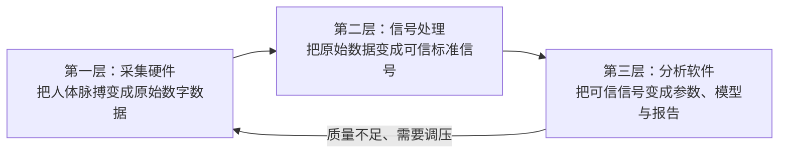

# Digital Pulse Diagnosis

面向桡动脉脉搏数字化的自适应寻脉与多压力采集系统。

> 当前状态：P0 合成环境闭环已通过并合并；P1-01 传感器选型与真实采集硬件验证已启动。仓库中的诊断、脉象识别和人体性能指标均为研究目标，除非附有真实实验记录，否则不代表已经实现或具备医疗有效性。

## 项目核心：三层系统

本项目按照一条明确的数据可信链建设：



| 系统层 | 主要组成 | 交付结果 |
|---|---|---|
| 采集硬件 | 探头、动态传感器、载荷传感器、模拟前端、ADC、MCU、施压机构 | 带时间戳、位置、接触力和设备状态的原始数字脉搏数据 |
| 信号处理 | 校准、完整性检查、质量控制、滤波、伪影检测、逐搏切分 | 可信波形、质量标签、单搏片段和客观特征 |
| 分析软件 | 会话管理、实时界面、数据存储、参数分析、研究模型、报告 | 心率、节律、形态、压力响应，以及后续候选脉象 |

建设顺序不能颠倒：采集数据不可靠时不训练脉象模型；信号质量不通过时，分析软件必须拒绝生成结果并提示重采。

## P0实施基线

P0 已形成并合并完整的合成环境实施闭环：

- [P0阶段设计与实现详解](docs/00-项目总览/P0阶段设计与实现详解.md)（理解文档：P0 做了什么、没做什么）
- [P0阶段实施总方案](docs/00-项目总览/P0阶段实施总方案.md)
- [P0阶段验收报告](docs/05-验证与实验/P0阶段验收报告.md)

实施依据：

- [系统需求规格说明书](docs/01-系统规范/系统需求规格说明书.md)
- [接口与通信协议](docs/01-系统规范/接口与通信协议.md)
- [数据与文件规范](docs/01-系统规范/数据与文件规范.md)
- [设备状态机与安全设计](docs/01-系统规范/设备状态机与安全设计.md)
- [脉搏信号模拟器设计](docs/03-信号处理/脉搏信号模拟器设计.md)
- [信号处理详细设计](docs/03-信号处理/信号处理详细设计.md)
- [分析软件详细设计](docs/04-分析软件/分析软件详细设计.md)
- [P0测试与验收计划](docs/05-验证与实验/P0测试与验收计划.md)

已实现：

- 小端二进制协议 v0、CRC32、确定性合成脉搏波和多载荷设备模拟器；
- 原始帧优先落盘、会话清单、事件日志、完整性统计和离线重放；
- 基线处理、峰检测、心率、压力分段、质量门控和最佳载荷选择；
- FastAPI REST/WebSocket 服务与 React/TypeScript 实时波形界面；
- 15 项自动化测试、故障注入、30 分钟/450,000 帧连续运行和前端生产构建验收。

本地运行：

```bash
python -m venv .venv
# Windows: .venv\Scripts\activate
# Linux/macOS: source .venv/bin/activate
pip install -e .
python -m unittest discover -s tests -v
pulse-simulator --output simulated-session.bin --forces 40 80 120
pulse-api
```

另开终端启动前端：

```bash
cd web
npm install
npm run dev
```

API 默认位于 `http://localhost:8000`，前端默认位于 `http://localhost:5173`。

这些载荷值和合成波形仅用于验证软件流程，不是人体安全压力或医学模型。

## P1当前执行入口

- [P1阶段实施总方案](docs/00-项目总览/P1阶段实施总方案.md)
- [首批传感器选型实验方案](docs/02-采集硬件/首批传感器选型实验方案.md)
- [P1首批采购与验收清单](docs/02-采集硬件/P1首批采购与验收清单.md)
- [P1台架实验记录模板](docs/05-验证与实验/P1台架实验记录模板.md)

P1先比较传感器与ADC，再搭建真实单点采集；尚未通过台架和仿体阶段门前，不进行人体采集。

## 首个可交付目标

完成单点“关部”桌面式原型：

1. 手动定位桡动脉；
2. 同步采集动态脉搏波与静态接触力；
3. 通过丝杆执行机构完成分层自动施压；
4. 在电脑端实时显示并保存原始数据；
5. 完成质量判断、逐搏切分和客观参数；
6. 用多人、重复佩戴实验评价有效信号率、压力控制误差、心率误差和重测一致性。

自动寻脉、寸关尺阵列、脉象识别和医生协作数据集属于后续阶段。

## 文档导航

### 三层系统核心文档

- [采集硬件方案](docs/02-采集硬件/采集硬件方案.md)
- [信号处理方案](docs/03-信号处理/信号处理方案.md)
- [分析软件方案](docs/04-分析软件/分析软件方案.md)

### 总体与管理文档

- [项目总体方案](docs/00-项目总览/项目总体方案.md)
- [系统架构](docs/00-项目总览/系统架构.md)
- [验证与实验方案](docs/05-验证与实验/验证与实验方案.md)
- [开发路线图](docs/00-项目总览/开发路线图.md)
- [工程决策记录](docs/06-项目管理/工程决策记录.md)

## 如何阅读与执行

如果你是第一次进入项目，按以下顺序阅读：

1. [项目总体方案](docs/00-项目总览/项目总体方案.md)：明确目标、边界和完整路线；
2. [系统架构](docs/00-项目总览/系统架构.md)：理解采集硬件—信号处理—分析软件三层关系；
3. [开发路线图](docs/00-项目总览/开发路线图.md)：确认当前阶段；
4. [P0阶段设计与实现详解](docs/00-项目总览/P0阶段设计与实现详解.md)：理解当前已交付的合成环境闭环；
5. 进入当前阶段对应目录，不需要一次读完所有文档。

当前状态是 P1-01 传感器与ADC候选冻结。当前主要工作是：

- [首批传感器选型实验方案](docs/02-采集硬件/首批传感器选型实验方案.md)；
- [Issue #6：首批传感器对比与采购清单](https://github.com/cxjchelsea/digital-pulse-diagnosis/issues/6)；
- [Issue #7：手动单点桡动脉采集原型](https://github.com/cxjchelsea/digital-pulse-diagnosis/issues/7)。

## 仓库结构

```text
digital-pulse-diagnosis/
├── README.md
├── docs/
│   ├── 00-项目总览/       # 先读：目标、架构、路线
│   ├── 01-系统规范/       # 三层共同遵守的需求、协议、数据和安全
│   ├── 02-采集硬件/       # 传感器、ADC、探头和后续施压机构
│   ├── 03-信号处理/       # 模拟器、质控、滤波、逐搏和特征
│   ├── 04-分析软件/       # 会话、界面、参数、模型和报告
│   ├── 05-验证与实验/     # 测试、验收、重复性和人体工程验证
│   └── 06-项目管理/       # 工程决策记录
├── src/digital_pulse/     # P0协议、模拟器、会话、处理流水线和API
├── tests/                 # 自动化测试
├── web/                   # React/TypeScript实时采集与分析界面
├── firmware/              # P1后建立MCU固件
├── apps/                  # 后续采集服务与Web分析软件
├── hardware/              # 后续原理图、PCB、CAD与BOM
└── protocols/             # 后续机器可读协议与Schema
```

文档文件名使用中文；Python包、源码目录和GitHub约定文件保留英文。

## 技术栈

- MCU：先用ESP32-S3开发板快速验证，出现明确瓶颈后再评估STM32；
- 固件：C/C++、PlatformIO，后期按需要引入FreeRTOS；
- 采集与分析服务：Python、FastAPI；
- 界面：React、TypeScript、WebSocket/SSE；
- 数据：Parquet/HDF5、SQLite/PostgreSQL；
- 算法：NumPy、SciPy、pandas、scikit-learn，数据充分后使用PyTorch；
- 硬件设计：KiCad；
- 结构设计：Fusion 360、SolidWorks或FreeCAD；
- 仿真：Python、LTspice/ngspice，必要时使用Simulink。

## 阶段门

| 阶段 | 三层重点 | 关键结果 |
|---|---|---|
| P0 | 信号处理＋分析软件 | 模拟波形、协议、质量算法、实时界面 |
| P1 | 采集硬件 | 手动单点真实桡动脉波形 |
| P2 | 采集硬件＋信号处理 | 接触力同步和可重复压力响应 |
| P3 | 采集硬件 | 单探头自动施压闭环与安全状态机 |
| P4 | 三层集成 | 多人重复性和完整系统验证 |
| P5 | 采集硬件升级 | 自动寻脉与空间定位 |
| P6 | 分析软件升级 | 医生合作和脉象多标签研究 |

## 安全声明

本项目是研发与学习原型，不用于诊断、治疗或替代专业医务人员。任何人体实验都应采用机械限位、软件压力上限、急停/快速释放和知情同意；涉及患者、疾病标签或临床结论时，应先获得合规与伦理支持。

## License

暂不设置许可证。在确定硬件开放范围、数据许可和潜在医疗器械知识产权策略前，保留全部权利。
