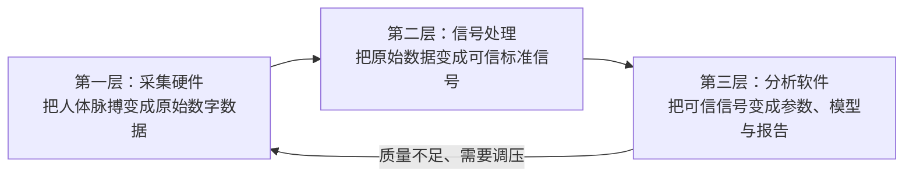

# Digital Pulse Diagnosis

面向桡动脉脉搏数字化的自适应寻脉与多压力采集系统。

> 当前状态：概念验证与工程规划阶段。仓库中的诊断、脉象识别和性能指标均为研究目标，除非附有实验记录，否则不代表已经实现或具备医疗有效性。

## 项目核心：三层系统

本项目按照一条明确的数据可信链建设：



| 系统层 | 主要组成 | 交付结果 |
|---|---|---|
| 采集硬件 | 探头、动态传感器、载荷传感器、模拟前端、ADC、MCU、施压机构 | 带时间戳、位置、接触力和设备状态的原始数字脉搏数据 |
| 信号处理 | 校准、完整性检查、质量控制、滤波、伪影检测、逐搏切分 | 可信波形、质量标签、单搏片段和客观特征 |
| 分析软件 | 会话管理、实时界面、数据存储、参数分析、研究模型、报告 | 心率、节律、形态、压力响应，以及后续候选脉象 |

建设顺序不能颠倒：采集数据不可靠时不训练脉象模型；信号质量不通过时，分析软件必须拒绝生成结果并提示重采。

## 首个可交付目标

完成单点“关部”桌面式原型：

1. 手动定位桡动脉；
2. 同步采集动态脉搏波与静态接触力；
3. 通过丝杆执行机构完成分层自动施压；
4. 在电脑端实时显示并保存原始数据；
5. 完成质量判断、逐搏切分和客观参数；
6. 用多人、重复佩戴实验评价有效信号率、压力控制误差、心率误差和重测一致性。

自动寻脉、寸关尺阵列、脉象识别和医生协作数据集属于后续阶段。

## 文档导航

### 三层系统核心文档

- [采集硬件方案](docs/采集硬件方案.md)
- [信号处理方案](docs/信号处理方案.md)
- [分析软件方案](docs/分析软件方案.md)

### 总体与管理文档

- [项目总体方案](docs/项目总体方案.md)
- [系统架构](docs/系统架构.md)
- [验证与实验方案](docs/验证与实验方案.md)
- [开发路线图](docs/开发路线图.md)
- [工程决策记录](docs/工程决策记录.md)

## 仓库结构

```text
digital-pulse-diagnosis/
├── README.md
├── docs/
│   ├── 项目总体方案.md
│   ├── 系统架构.md
│   ├── 采集硬件方案.md
│   ├── 信号处理方案.md
│   ├── 分析软件方案.md
│   ├── 验证与实验方案.md
│   ├── 开发路线图.md
│   └── 工程决策记录.md
├── firmware/       # MCU固件，进入实作阶段后建立
├── simulator/      # 脉搏信号与设备协议模拟器
├── apps/           # 采集服务与Web分析软件
├── analysis/       # 信号处理、特征与模型实验
├── hardware/       # 原理图、PCB、CAD与BOM
├── protocols/      # 通信和数据格式定义
└── tests/          # 软件、硬件在环与实验测试
```

`README.md`和`.gitignore`保留行业通用文件名，其余说明文档统一使用中文文件名。

## 技术栈

- MCU：先用ESP32-S3开发板快速验证，出现明确瓶颈后再评估STM32；
- 固件：C/C++、PlatformIO，后期按需要引入FreeRTOS；
- 采集与分析服务：Python、FastAPI；
- 界面：React、TypeScript、WebSocket/SSE；
- 数据：Parquet/HDF5、SQLite/PostgreSQL；
- 算法：NumPy、SciPy、pandas、scikit-learn，数据充分后使用PyTorch；
- 硬件设计：KiCad；
- 结构设计：Fusion 360、SolidWorks或FreeCAD；
- 仿真：Python、LTspice/ngspice，必要时使用Simulink。

## 阶段门

| 阶段 | 三层重点 | 关键结果 |
|---|---|---|
| P0 | 信号处理＋分析软件 | 模拟波形、协议、质量算法、实时界面 |
| P1 | 采集硬件 | 手动单点真实桡动脉波形 |
| P2 | 采集硬件＋信号处理 | 接触力同步和可重复压力响应 |
| P3 | 采集硬件 | 单探头自动施压闭环与安全状态机 |
| P4 | 三层集成 | 多人重复性和完整系统验证 |
| P5 | 采集硬件升级 | 自动寻脉与空间定位 |
| P6 | 分析软件升级 | 医生合作和脉象多标签研究 |

## 安全声明

本项目是研发与学习原型，不用于诊断、治疗或替代专业医务人员。任何人体实验都应采用机械限位、软件压力上限、急停/快速释放和知情同意；涉及患者、疾病标签或临床结论时，应先获得合规与伦理支持。

## License

暂不设置许可证。在确定硬件开放范围、数据许可和潜在医疗器械知识产权策略前，保留全部权利。
