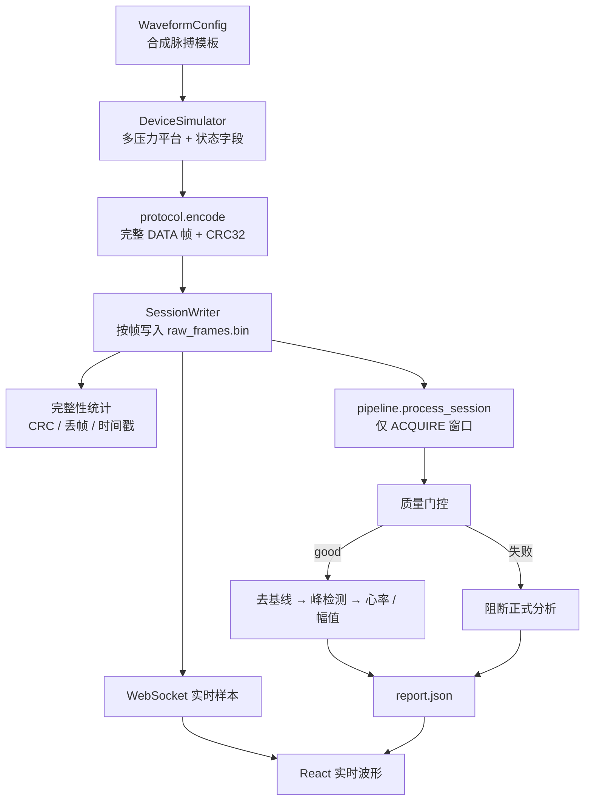

# D0 阶段设计与实现详解

版本：0.2.0  
状态：说明文档（对应已通过验收的 D0 / 原 P0 合成环境闭环）  
阅读对象：希望快速理解「D0 证明了什么、刻意没证明什么」的开发者与评审者

本文是理解文档，不是验收清单。执行口径以 [P0阶段实施总方案](./P0阶段实施总方案.md) 为准；验收证据见 [P0阶段验收报告](../05-验证与实验/P0阶段验收报告.md)。  
路线图中 **P0 = D0**；后文统一用 D0。

---

## 1. 一句话理解 D0

**D0 验证的是上位机内部链路是否打通**：拿到“像设备发来的”数据帧之后，协议解码、原始落盘、重放、质量门控、分析 API 和 Web 显示是否自洽。

它**不管**上下位机交互——不练握手、不练 START/STOP/ABORT、不练串口半包与断连。那些是 [D1](./D1阶段设计与实现详解.md) 的事。

```text
D0 范围（上位机内部）：
  数据帧已到手 → 解码 → 落盘 → 质控/分析 → API/Web

D0 不在范围（设备交互，留给 D1）：
  主机 ↔ 传输层 ↔ 下位机：HELLO / START / STOP / 分片 / 断连
```

---

## 2. 为什么先做 D0

本项目要建设桡动脉多压力采集系统：先证明「数据可信」，再研究脉象与 AI。建设顺序固定为三层：


买硬件之前，最容易先验证、也最值得先验证的，是上位机侧：

- 协议字段能不能编解码；
- 原始数据会不会丢、能不能重放；
- 质量差时会不会错误地给出“正式结果”；
- 分析结果能不能经 API / Web 看出来。

如果这条内部链都不通，接上真实 MCU 也只是把问题搅在一起。

---

## 3. D0 与「假设备」的关系（容易误解的点）

D0 里有一个 `DeviceSimulator`，会按正式协议生成 DATA 帧。但这**不是**上下位机联调：

| | D0 的做法 | 将来真设备 / D1 的做法 |
|---|---|---|
| 数据怎么来 | 上位机**直接调用**模拟器函数拿完整帧 | 经串口字节通道收发包 |
| 有没有命令平面 | 基本没有（不发 HELLO/START） | 有握手、开始/停止/急停 |
| 传输形态 | 整帧已在内存里 | 可能半包、粘包、断连 |
| 证明什么 | 上位机内部处理链 | 设备接入与通信行为 |

所以更准确的说法是：

> D0 有「假设备吐出的**数据形态**」，但没有真正的「上下位机**交互过程**」。  
> 上位机把模拟器当成一个“已经交来完整帧的数据源”，专心证明落盘、分析、显示。

---

## 4. 阶段目标与非目标

### 4.1 目标

在合成环境中打通上位机内部闭环：

```text
合成数据源 → 协议编码/解码 → 原始落盘 → 完整性统计
          → 信号处理 → 质量门控 → 分析 API → Web 展示
```

并冻结后续阶段仍应遵守的数据契约：

- 二进制 DATA 帧格式与 CRC；
- 样本字段（脉搏、载荷、状态、时间戳等）；
- 会话目录与 Manifest；
- 「质量不合格则阻断正式分析」的软件行为。

### 4.2 非目标

- 与下位机的命令交互、虚拟/真实串口（→ D1）；
- 标定模型与异常标定门控（→ D2）；
- 自动施压控制与安全故障矩阵（→ D3）；
- 真实传感器、MCU、人体测量（→ H1 及以后）；
- 脉象、疾病或治疗建议；
- 把合成指标写成真实设备或医学性能；
- 把模拟载荷 `40/80/120` 当作人体安全压力。

一句话：**D0 证明“上位机内部管道通了”，不证明“已经会跟设备对话”，更不证明“测人准了”。**

---

## 5. 端到端数据流（注意：无传输层）



图中没有 `DeviceTransport` / 串口 / HELLO：那是刻意省略，不是画漏了。

运行入口：

| 路径 | 入口 | 用途 |
|---|---|---|
| 批处理 | `POST /api/sessions/simulate` 或 `pulse-simulator` | 一次生成会话并出报告 |
| 实时流 | `WS /ws/simulate` | 边推波形，结束后返回 Manifest + 报告 |

两者都是上位机进程内调用模拟器，不是经设备链路命令采集。

---

## 6. 工作包分别实现了什么

### 6.1 规格基线

契约文档：需求、DATA 协议、数据文件规范、状态语义。  
意义：后续 D1/H1 扩展命令或换帧来源时，DATA 布局与会话结构不必推倒重来。

### 6.2 合成数据源（不是交互式下位机）

代码：`waveform.py` + `device.py`

| 模块 | 职责 |
|---|---|
| `waveform.py` | 确定性周期脉搏模板 + 噪声/基线等 |
| `device.py` | 多压力 profile、STABILIZE/ACQUIRE 状态字段、输出正式 DATA 帧 |

固定种子 → 逐样本一致，供回归测试。  
它填充的是「将来设备帧里也会有的字段」，但调用方式仍是函数返回，不是串口收发。

### 6.3 采集与存储

代码：`session.py`

原则：原始帧优先落盘，再解析统计。会话最小集：

```text
sessions/<session-id>/
├── manifest.json
├── raw_frames.bin
├── events.jsonl
└── processed/report.json
```

D0 落盘粒度主要是**完整帧**。D1 进一步强调**传输字节先落盘再组帧**（`append_bytes`），以贴近真串口。

### 6.4 信号流水线

代码：`signal.py` + `pipeline.py`

只处理 `ACQUIRE` 窗口 → 按载荷分组 → 质量门控 → 合格才算心率/幅值 → 选 `best_target_force`。  
质量失败时阻断正式参数。阈值属合成基线，H1 真实数据后须重冻。

### 6.5 分析软件

代码：`api.py` + `web/`

会话模拟、报告、WebSocket 实时图、免责声明。  
UI 展示的是研究结果（完整性、质量、心率、压力响应），不是脉象或诊断。

### 6.6 集成验收

- 自动化测试覆盖协议、CRC、确定性、信号门控、会话、API 等；
- 30 分钟连续模拟：250 Hz、450,000 帧、0 丢帧、0 CRC 错误；
- 前端生产构建通过。

---

## 7. 协议：D0 冻结的是 DATA 契约

实现：`protocol.py`  
文档：`接口与通信协议.md`

D0 重点冻结**数据帧**形态（公共头 + CRC + 样本字段）。  
命令/响应平面在 D0 协议头里预留了消息类型，但**交互语义与主机客户端在 D1 才真正实现并验收**。

样本最小语义：

```text
时间戳 + 动态脉搏 + 静态载荷 + 参考通道
+ 电机位置 + 目标载荷 + 设备状态 + 故障标志
```

错误策略（上位机侧）：CRC/长度错误整帧拒绝；序号缺口与时间戳回退可统计；质量失败阻断分析、不假装成安全故障。

---

## 8. 代码地图

```text
src/digital_pulse/
├── protocol.py   # DATA 帧编解码（D0 核心契约）
├── waveform.py   # 合成脉搏
├── device.py     # 合成多压力数据源（直接调用，非串口）
├── session.py    # 会话落盘、Manifest、重放
├── signal.py     # 质控、去基线、峰检测、心率
├── pipeline.py   # 分组 → 门控 → 报告
├── api.py        # FastAPI / WebSocket
└── cli.py        # 命令行生成模拟会话

# 以下主要属于 D1，不在 D0 验收范围
# transport.py / firmware.py / 控制帧命令语义
```

---

## 9. D0 证明了什么，没有证明什么

### 9.1 已证明（上位机内部 / 合成环境）

- DATA 协议可编解码，CRC 能拒绝损坏帧；
- 原始帧可完整落盘并重放；
- 序号缺口与时间戳错误可统计；
- 同种子输出一致；
- 干净合成波上心率误差可压到 &lt;1 bpm（非人体）；
- 无信号时正式分析被阻断；
- API + Web 能展示完整性与分析结果；
- 长时模拟运行无数据损坏。

### 9.2 明确未证明

| 未证明项 | 交给谁 |
|---|---|
| 握手、命令、虚拟/真实串口、半包与断连 | D1 |
| 版本化标定与异常标定 | D2 |
| 自动施压与安全故障矩阵 | D3 |
| 真实传感器波形与 MCU 固件 | H1 |
| 人体性能、脉象、医学结论 | H 线后续 / 不在早期范围 |

---

## 10. 在路线中的位置


| 阶段 | 相对 D0 |
|---|---|
| D0 | 上位机内部：帧 → 落盘 → 分析 → 显示 |
| D1 | 补上与下位机（或固件模拟器）的交互平面 |
| D2–D3 | 在数字环境继续消掉标定与控制风险 |
| H1 | 替换为真实传感链；复用已冻结的协议与上位机能力 |

---

## 11. 阅读路径

1. 本文：建立「D0 = 上位机内部链路」的心智模型；
2. [D1阶段设计与实现详解](./D1阶段设计与实现详解.md)：看清 D0 之后补上的设备交互层；
3. [P0阶段实施总方案](./P0阶段实施总方案.md) / [验收报告](../05-验证与实验/P0阶段验收报告.md)：执行口径与证据；
4. [开发路线图](./开发路线图.md)：D/H 双线全景。

---

## 12. 总结

| 维度 | 结论 |
|---|---|
| D0 本质 | 验证上位机内部数据闭环，不验证上下位机交互 |
| 核心交付 | DATA 协议、合成数据源、落盘重放、质量门控、分析 API、Web |
| 假设备角色 | 提供协议形态正确的帧；调用方式是进程内直接取帧 |
| 与 D1 分界 | D0 证明“帧到手之后怎么办”；D1 证明“帧怎么从设备链路上过来” |
| 边界 | 合成验证 ≠ 设备通信完成 ≠ 人体/医学性能 |
