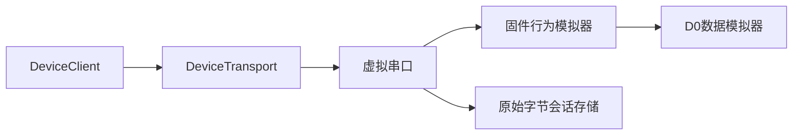

# D1设备通信数字原型实施方案

版本：1.0.0；状态：已按本方案实现，等待分支合并。

## 1. 目标

D1在不购买硬件的条件下冻结真实设备接入所需的软件边界：同一协议和字节传输接口既连接固件行为模拟器，也能在H1替换为真实串口。D1只证明通信和会话行为，不证明传感器、ADC或人体测量性能。

## 2. 范围

### 本阶段实现

- `DeviceTransport`字节传输抽象；
- 可分片、粘连和断连的`VirtualSerialTransport`；
- HELLO、CAPABILITIES、START、STOP、ABORT命令；
- ACK/NACK、请求ID、错误码和设备能力；
- 固件行为模拟器及IDLE/ACQUIRE/RETRACT状态转换；
- D0数据帧与D1控制帧共用协议头、版本和CRC；
- 原始传输字节先落盘，再从完整帧解析；
- 后端D1演示接口及前端握手状态；
- 分片、状态、急停、断连和回归测试。

### 不在本阶段实现

- 真实COM口和MCU固件；
- ADC、传感器和工程单位标定；
- 自动施压被控对象与PID；
- 人体安全载荷或真实硬件指标。

真实串口适配器在H1引入`pyserial`后实现，但不得改变`DeviceTransport`和协议语义。

## 3. 架构

H1只替换虚拟串口和固件行为模拟器，主机客户端、协议、会话存储和上层软件保持不变。

## 4. 通信契约

所有帧继续使用协议v0公共头和CRC32。控制载荷包含命令码、请求ID和确定性JSON对象。

| 命令 | 合法状态 | 成功结果 | 失败结果 |
|---|---|---|---|
| HELLO | 任意已连接状态 | ACK＋身份、版本、能力、当前状态 | 协议错误 |
| CAPABILITIES | 任意已连接状态 | ACK＋采样率、通道、标定版本 | 协议错误 |
| START | IDLE | ACK，进入ACQUIRE | INVALID_STATE |
| STOP | ACQUIRE | ACK，进入IDLE | INVALID_STATE |
| ABORT | 任意状态 | ACK，先进入RETRACT再回IDLE | 不因普通状态拒绝 |

错误码固定为NONE、INVALID_COMMAND、INVALID_STATE、INVALID_ARGUMENT、UNSUPPORTED和INTERNAL_ERROR。

## 5. 模块与文件

| 文件 | 职责 |
|---|---|
| `src/digital_pulse/protocol.py` | 控制帧、命令、响应、错误码和编解码 |
| `src/digital_pulse/transport.py` | 传输接口、虚拟串口和链路故障 |
| `src/digital_pulse/firmware.py` | 固件行为模拟器、能力和主机客户端 |
| `src/digital_pulse/session.py` | 字节先落盘、增量组帧和不完整尾部 |
| `src/digital_pulse/api.py` | D1演示接口和阶段状态 |
| `web/src/main.tsx` | 服务状态与虚拟设备握手状态 |

## 6. 测试矩阵

| ID | 场景 | 预期 |
|---|---|---|
| D1-T01 | 命令帧往返 | 字段完全一致 |
| D1-T02 | 响应帧往返 | 状态、错误和数据一致 |
| D1-T03 | 3/5字节随机边界式分片 | HELLO仍只解析为一个完整帧 |
| D1-T04 | HELLO/CAPABILITIES | 返回稳定设备能力 |
| D1-T05 | START→数据→STOP | ACQUIRE、数据帧、IDLE顺序正确 |
| D1-T06 | IDLE下ABORT | 不被普通状态拒绝，执行RETRACT语义 |
| D1-T07 | 注入断连 | 主机收到明确TransportError |
| D1-T08 | 分片原始字节存储 | 落盘字节与输入完全一致 |
| D1-T09 | D0协议与算法回归 | 原有测试保持通过 |
| D1-T10 | Web生产构建 | TypeScript和Vite通过 |
| D1-T11 | 端口消失后替换传输并重新握手 | 请求ID保持单调，新设备ACK |
| D1-T12 | 60秒、250 Hz、15000帧分片流 | 无丢帧且序号连续 |
| D1-T13 | 断连留下不完整尾帧 | 会话标为未完成并记录事件 |

## 7. 退出标准

- D1新增测试全部通过；
- D0非API回归测试全部通过；
- 前端生产构建通过；
- HELLO、CAPABILITIES、START、STOP、ABORT均有自动测试证据；
- 分片和断连均可复现；
- 原始字节先落盘得到测试证明；
- 前端能显示D1服务与虚拟设备握手状态；
- 未把虚拟串口称为真实COM口，未声明任何真实硬件性能。

## 8. 进入D2前遗留项

- 将命令和能力Schema生成机器可读版本；
- 在H1前实现真实`SerialTransport`并用同一测试套件验收；
- API测试需要安装项目依赖后运行，不能因当前执行环境缺包而视为通过。
