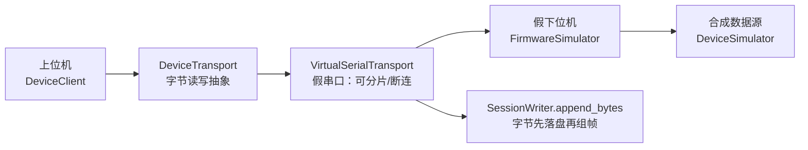

# D1 阶段设计与实现详解

版本：1.1.0  
状态：说明文档（对应「D1 已实现、待合并前完整验收」）  
阅读对象：希望快速理解「D1 相对 D0 多了什么」以及「H1 接入时复用什么」的开发者与评审者

本文是理解文档，不是验收清单。执行口径以 [D1设备通信数字原型实施方案](./D1设备通信数字原型实施方案.md) 为准；验收证据见 [D1阶段验收报告](../05-验证与实验/D1阶段验收报告.md)。

---

## 1. 一句话理解 D1

**D1 = 仍然用软件假下位机和合成数据，但改成走真实设备才会用的交互路径**——指令收发、字节传输、分片/断连、组帧落盘——用来冻结上位机与设备之间的软件边界。

对照 [D0](./D0阶段设计与实现详解.md)：

| | D0 | D1 |
|---|---|---|
| 证明什么 | 上位机**内部**会处理帧 | 上位机**对外**会跟“设备”说话 |
| 数据还是不是合成的 | 是 | **仍是** |
| 对端是什么 | 无独立设备角色；进程内直接取帧 | **假下位机**（`FirmwareSimulator`） |
| 上位机怎么拿到帧 | 直接调用 `DeviceSimulator` | 经传输层收字节 → 拼完整帧 |
| 有没有命令交互 | 基本没有 | HELLO / START / STOP / ABORT |
| 是不是真 MCU / 真 COM | 否 | **仍否**（H1 才是） |

```text
D0：上位机内部
  DeviceSimulator() 直接交来完整 DATA 帧
  → 落盘 → 分析 → Web

D1：设备交互（假下位机 + 真交互形态）
  上位机 DeviceClient
    ↔ VirtualSerialTransport（可分片、可断连的字节通道）
    ↔ FirmwareSimulator（假下位机：收指令、回 ACK、再吐数据）
  原始字节先落盘 → 再拼接完整帧 → 再进入既有分析链
```

常见误解纠正：

- ❌「D1 换成了真实下位机」→ 仍是 Python 行为模拟器  
- ❌「D1 不再使用模拟数据」→ 波形多半仍由 D0 模拟器生成，只是**经链路传回**  
- ✅「D1 练的是交互：指令能否到达、传输能否分片/断连、回来能否拼成完整帧」

---

## 2. D1 在路线中的位置

项目采用 **数字原型 D 线 + 实体验证 H 线**：

| 阶段 | 核心问题 | 状态 |
|---|---|---|
| D0（原 P0） | 上位机内部数据闭环是否成立 | 已完成并合并 |
| **D1** | **与设备交互的软件准备是否完整** | **已实现，待合并前全量验收** |
| D2 | 标定与多压力实验流程是否完整 | 未开始 |
| D3 | 自动施压与安全逻辑是否可验证 | 未开始 |
| H1 | 真实传感链是否成立 | 等待 D1–D3 |

D1 回答的不是「传感器准不准」，而是：

> 上位机指令能否被对端正确处理？字节通道分片/断连时能否可靠组帧与落盘？  
> 这些问题是否已稳定到 H1 只需把「虚拟串口 + 假固件」换成「真实串口 + MCU 固件」？

---

## 3. 阶段目标与非目标

### 3.1 目标

在不购买硬件的条件下，用**假下位机**演练并冻结真实接入所需的交互边界：

1. 统一字节传输接口 `DeviceTransport`（读写的是字节，不保证一读一帧）；
2. 可注入分片 / 断连的虚拟串口；
3. HELLO、CAPABILITIES、START、STOP、ABORT 及 ACK/NACK；
4. 固件行为模拟器（IDLE ↔ ACQUIRE，ABORT → RETRACT → IDLE）；
5. 控制帧与 D0 数据帧共用协议头、版本和 CRC；
6. **原始传输字节先落盘，再从完整帧解析**；
7. 验证：指令可达、传输可脏、回程可组帧；
8. API / Web 能展示握手状态。

### 3.2 非目标

- 真实 COM 口、`pyserial`、ESP32 固件；
- 停止使用合成波形（D1 不负责换成真人/真传感器数据）；
- ADC、传感器、工程单位标定（属 D2 / H1）；
- 自动施压 PID 与被控对象（属 D3）；
- 人体安全载荷或任何真实硬件性能指标。

**D1 只证明通信和会话行为，不证明传感或医学性能。**

---

## 4. 架构：假下位机在链路哪一侧



要点：

- **假下位机**站在传输层对端，负责听命令、回响应、在 ACQUIRE 下往链路写 DATA 帧；
- DATA 帧内容仍可来自 D0 的合成器，但上位机**不得**绕过传输层直接调用它来完成 D1 交互验收；
- H1 预期只替换虚线框里的两层：虚拟串口 → 真串口，假固件 → MCU 固件。

| 替换（H1） | 保持不变 |
|---|---|
| `VirtualSerialTransport` → 真实 `SerialTransport` | `DeviceClient`、协议编解码 |
| Python `FirmwareSimulator` → MCU 固件 | 会话存储、质量流水线、分析 API |

---

## 5. D1 实际交付了什么

### 5.1 传输抽象与虚拟串口

文件：`src/digital_pulse/transport.py`

| 组件 | 职责 |
|---|---|
| `DeviceTransport` | `write` / `read` / `close` / `connected` |
| `VirtualSerialTransport.pair` | 全双工内存字节链路（**不是** OS COM 口） |
| `LinkFaults` | `max_chunk_size` 强制分片；`disconnect_after_writes` 注入断连 |
| `TransportError` | 断连对上位机可见，不可静默吞掉 |

刻意暴露**字节块而非帧**：用来证明「分片后仍能拼回完整帧」。

### 5.2 控制协议：上位机对假下位机的指令

文件：`src/digital_pulse/protocol.py`  
规范：`docs/01-系统规范/D1设备通信协议扩展.md`

| 命令 | 合法状态 | 成功行为 |
|---|---|---|
| HELLO | 已连接任意状态 | ACK + 身份、版本、能力、当前状态 |
| CAPABILITIES | 已连接任意状态 | ACK + 采样率、通道、标定版本等 |
| START | 仅 IDLE | ACK，进入 ACQUIRE |
| STOP | 仅 ACQUIRE | ACK，回到 IDLE |
| ABORT | **任意状态** | ACK，先 RETRACT 再回 IDLE；不被普通状态拒绝 |

响应含 `status`（ACK/NACK）、`error`、`data`，用 `request_id` 关联。  
D1 要验证的正是：**这些指令对端收得到、状态判得对、错误回得明。**

### 5.3 假下位机与上位机客户端

文件：`src/digital_pulse/firmware.py`

| 组件 | 角色 |
|---|---|
| `FirmwareSimulator` | **假下位机**：收命令字节 → 组帧 → 状态转换 → 回 RESPONSE；ACQUIRE 下可 `emit_profile` 往链路吐合成 DATA |
| `DeviceClient` | **上位机侧客户端**：发命令、收字节、拆完整帧 |
| `DeviceCapabilities` | 假设备对外声明的能力清单 |

状态语义是通信侧最小集：IDLE / ACQUIRE / RETRACT。完整施压状态机属 D3 / H3。

### 5.4 传回后：字节先落盘，再拼完整帧

文件：`session.py` 的 `append_bytes`

```text
收到 transport chunk（可能是半帧）
  → 立刻写入 raw_frames.bin
  → 再与尾部缓冲拼接
  → 拼出完整帧才解析 / 统计
  → 关闭时若有残留 → completed=false + incomplete_tail
```

这对应理解中的「传回后是否能够拼接完整帧」，并保证原始链路证据可追溯。

### 5.5 API 与前端握手状态

| 位置 | D1 增量 |
|---|---|
| `GET /api/health` | `stage: "D1"` |
| `GET /api/device/d1-demo` | 在分片虚拟链路上跑 HELLO→CAPABILITIES→START→STOP |
| Web 页头 | 「服务状态」与「虚拟设备握手」分开显示 |

`fragment_size` 故意把帧拆开，证明握手不依赖「一读一帧」。

### 5.6 测试与验收证据

| 类别 | 覆盖的理解点 |
|---|---|
| `test_d1_protocol.py` | 命令/响应帧本身可往返 |
| `test_d1_transport.py` | 分片仍能握手；START→流→STOP；ABORT 优先；断连可见 |
| `test_session_pipeline.py` | 分片字节先落盘再组帧 |
| D0 回归 | 上位机内部分析链未被破坏 |
| Web 构建 | 握手状态可展示 |

当前结论：**功能已实现**；正式标「D1 完成」前需在依赖完整环境跑含 API 的全量测试并记录合并 SHA。尚未进入 D2。

---

## 6. 端到端时序（交互路径）

```mermaid
sequenceDiagram
    participant Host as 上位机 DeviceClient
    participant Link as 假串口 VirtualSerial
    participant Dev as 假下位机 FirmwareSimulator

    Host->>Link: 写入 COMMAND 字节（可被拆成多块）
    Link->>Dev: poll 拼出完整命令帧
    Dev->>Link: 写入 RESPONSE ACK
    Link->>Host: receive 拼出完整响应帧
    Note over Host,Dev: START 成功后
    Dev->>Link: 写入合成 DATA 帧字节
    Link->>Host: 分片到达 → 落盘 → 组帧
```

说明：页面上「开始模拟采集」仍可能走 D0 直连分析路径；D1 新增并验收的是上面这条**设备命令与传输平面**。两条能力可以并存，不要混成「D1 已经全面取代 D0 数据入口」。

---

## 7. 代码地图

```text
src/digital_pulse/
├── protocol.py    # D0 DATA + D1 COMMAND/RESPONSE
├── transport.py   # 假串口 / 分片 / 断连          ← D1
├── firmware.py    # 假下位机 + 上位机客户端       ← D1
├── session.py     # append_bytes：字节先落盘再组帧 ← D1 强化
├── device.py      # 合成 DATA 源（假下位机在 ACQUIRE 时仍可调用）
├── api.py         # /api/device/d1-demo
└── ...
```

---

## 8. D1 证明了什么，没有证明什么

### 8.1 已证明（数字环境中的交互）

- 上位机指令可被假下位机收到并正确 ACK/NACK；
- 分片链路上仍能完成握手与能力查询；
- START→DATA→STOP 顺序正确；
- ABORT 不被普通状态拒绝；
- 断连以 `TransportError` 明确暴露；
- 分片字节可先落盘，再跨 chunk 拼成完整帧；
- 前端能区分「服务正常」与「虚拟设备握手」；
- D0 内部分析回归未被破坏。

### 8.2 未证明

- 真实串口 / USB CDC / 波特率稳定性；
- MCU 固件实时性与可靠性；
- 传感器、ADC、标定、人体或医学指标；
- 自动施压安全。

再次强调：虚拟串口 ≠ 真 COM；假下位机 ≠ ESP32；合成数据经链路传回 ≠ 真实采集。

---

## 9. 与 D0 / D2 / H1 的衔接

| 方向 | 关系 |
|---|---|
| 相对 D0 | D0 证明“帧到手之后怎么办”；D1 证明“帧怎么经设备交互过来” |
| 数据连续性 | 合成数据源可继续存在，但 D1 交互验收必须走传输层 |
| 进入 D2 | 在“已能命令设备”的前提上做标定与多压力数字实验 |
| 进入 H1 | 换真串口 + 真固件，**复用** D1 同一套握手/分片/断连/落盘测试 |

进入 D2 前遗留：命令/能力 Schema 机器可读版、长时链路压力测试、H1 前真实 `SerialTransport`、依赖完整环境下的全量 API 测试与合并记录。

---

## 10. 阅读路径

1. [D0阶段设计与实现详解](./D0阶段设计与实现详解.md)：上位机内部闭环；
2. 本文：假下位机 + 真交互路径；
3. [D1设备通信数字原型实施方案](./D1设备通信数字原型实施方案.md)：退出标准与测试矩阵；
4. [D1设备通信协议扩展](../01-系统规范/D1设备通信协议扩展.md) + `transport.py` / `firmware.py`；
5. [D1阶段验收报告](../05-验证与实验/D1阶段验收报告.md)。

---

## 11. 总结

| 维度 | 结论 |
|---|---|
| D1 本质 | 用假下位机演练真实设备交互，冻结通信与会话软件边界 |
| 仍保留 | 合成数据、无真 MCU / 真 COM |
| 真正增量 | 指令平面、字节传输、分片/断连、回程组帧与字节先落盘 |
| 心智模型 | D0 = 上位机内部会处理帧；D1 = 上位机对外会跟“设备”说话 |
| 当前状态 | 已实现；正式完成前需全量测试 + 合并记录 |
| 下一步 | D2；H1 等待 D1–D3 |
