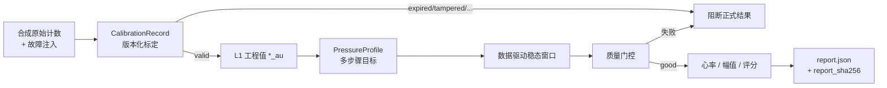

# D2 阶段设计与实现详解

版本：0.1.0  
状态：说明文档（对应「D2 已实现、等待完整环境验收」）  
阅读对象：希望快速理解「D2 相对 D0/D1 多了什么」的开发者与评审者

本文是理解文档，不是验收清单。执行口径以 [D2标定与多压力数字实验实施方案](./D2标定与多压力数字实验实施方案.md) 为准；验收证据见 [D2阶段验收报告](../05-验证与实验/D2阶段验收报告.md)。

---

## 1. 一句话理解 D2

**D2 = 在仍不买硬件的前提下，给合成数据补上「版本化标定 + 多压力稳态实验 + 故障门控 + 可追溯报告」。**

它回答的不是「传感器准不准」，而是：

> 原始计数能否按标定变成工程值？标定坏了会不会被拦住？多压力平台能否用数据（而不是状态字）判断稳态？只有合格窗口才能进压力响应与候选评分吗？同样子能否重放出同一份报告？

对照前两阶段：

| | D0 | D1 | D2 |
|---|---|---|---|
| 核心问题 | 上位机内部会不会处理帧 | 上位机会不会跟“设备”说话 | **标定与多压力实验链是否可信** |
| 数据 | 合成 | 仍合成 | **仍合成** |
| 主要增量 | 落盘 / 质控 / 分析 / Web | 传输层 + 命令 + 分片断连 | **标定模型、压力 Profile、稳态判据、故障注入、评分报告** |
| 单位 | 原始计数为主 | 协议字段 | 合成相对单位 `*_au`（禁止当 N/mmHg） |
| 是不是真硬件 | 否 | 否 | **仍否** |

```text
D0：帧到手 → 落盘 → 质控 → 心率/显示
D1：上位机 ↔ 假串口 ↔ 假下位机（指令/分片/断连）
D2：原始计数 → 版本化标定 → 工程值(*_au)
      → 多压力 Profile + 数据驱动稳态
      → 质量门控 → 压力响应评分 → 可追溯报告
```

常见误解：

- ❌「D2 已经在用真实力传感器标定」→ 标定关系也是合成的  
- ❌「40/80/120 au 是人体安全压力」→ 只是相对单位实验平台  
- ✅「D2 练的是：标定有效才出工程值；稳态与质量合格才进响应；报告可复现、可追溯」

---

## 2. 在路线中的位置

| 阶段 | 核心问题 | 状态（以验收报告为准） |
|---|---|---|
| D0 | 上位机内部数据闭环 | 已完成并合并 |
| D1 | 设备通信软件边界 | 已完成并合并 |
| **D2** | **标定与多压力数字实验是否完整** | **代码已实现，等待完整环境验收** |
| D3 | 自动施压与安全控制仿真 | 未开始 |
| H1 | 真实传感链 | 等待 D2、D3 |

D2 通过后，才更有资格在 H1 用真实参考器具把 `*_au` 换成可追溯物理单位；**现在不得进入 H1 采购，也不得标 D2 完成**（见验收报告）。

---

## 3. 阶段目标与非目标

### 3.1 目标（方案冻结的六条）

1. 已知标定关系能正确恢复合成工程值；
2. 标定缺失 / 过期 / 非法 / 越界 / 篡改时阻断正式结果；
3. 多压力实验的目标、稳定、采集和失败过程可配置、可重放；
4. 只有标定有效且质量合格的稳态窗口才能进入压力响应；
5. 相同输入、种子、标定和代码版本生成相同报告；
6. 原始数据、标定、配置、派生结果和报告可追溯。

### 3.2 非目标

- 真实 ADC、传感器灵敏度、迟滞、温漂；
- 真实力值（N）、血压单位（mmHg）或人体安全载荷；
- 真实硬件“最佳接触压力”；
- 脉象或医学有效性；
- 自动施压 PID / 安全状态机（→ D3）。

单位约定：`pulse_au` / `force_au` / `reference_au`。`au` = 合成相对单位。

---

## 4. 端到端数据流



相对 D0 的关键升级：

- D0 多压力更依赖模拟器状态字（如 `ACQUIRE`）；
- **D2 必须用载荷数据重新验证稳态**（容差 + 变化率 + 最短稳定时间），不能只信状态枚举。

---

## 5. 实际交付了什么

### 5.1 版本化标定（`calibration.py`）

不可变 `CalibrationRecord`：

- 通道：`pulse` / `force` / `reference`
- 模型：`offset` / `affine` / `piecewise_linear`
- 原始点 ↔ 工程点、有效期、来源、`checksum`（规范化内容 SHA-256）

使用前校验：单位匹配、点数与单调性、checksum、有效期、样本是否在标定范围内。  
失败抛出带 `code` 的 `CalibrationError`（如 `expired`、`out_of_range`、`checksum_mismatch`），**不静默外推**。

### 5.2 多压力实验与故障（`d2_experiment.py`）

| 组件 | 职责 |
|---|---|
| `D2PressureStep` | 目标 `force_au`、接近/稳定/采集时间、容差、超时 |
| `PressureProfile` | 有序步骤、重复次数、显式 `seed` |
| `D2FaultConfig` | 零偏、增益、噪声、漂移、非线性、迟滞、削顶、运动、断线、永不稳定等 |
| `stable_mask` | 用数据判定稳态掩码 |
| `run_d2_experiment` | 生成合成力迹与脉搏 → 标定 → 稳态窗口 → 质控 → 逐步结果 → 候选评分 → 报告哈希 |

评分（通过硬门控后）：质量 40% + 幅值 25% + 稳定性 20% + 覆盖率 15%。  
选出 `best_target_force_au`（合成平台候选，**不是人体最佳压力**）。

### 5.3 Schema 与可追溯存储

- `protocols/d2-calibration.schema.json`
- `protocols/d2-pressure-profile.schema.json`
- 实验落盘：`sessions/d2-experiments/<report_sha256>/`  
  - `calibration.json` / `request.json` / `report.json`

### 5.4 API

| 接口 | 作用 |
|---|---|
| `GET /api/health` | `stage: "D2"` |
| `POST /api/experiments/d2/run` | 跑合成标定实验并持久化 |
| `GET /api/experiments/d2/{report_sha256}` | 取报告 |
| `POST /api/experiments/d2/{report_sha256}/replay` | 用同一标定/请求重跑，检查哈希是否一致 |

请求可注入：`expired_calibration`、`never_stable_step`、`clipping_raw`、`motion_start_s` 等。

### 5.5 前端

Web 增加「运行 D2 实验」：展示标定 ID、分析门控、候选平台（au）、报告摘要、各步质量/稳态样本/评分，并带相对单位免责声明。D1 握手状态仍可显示。

### 5.6 测试与验收状态

| 覆盖 | 文件/手段 |
|---|---|
| 标定校验与转换 | `tests/test_calibration.py` |
| 同种子可复现、过期阻断、永不稳定局部门控、迟滞方向、断线等 | `tests/test_d2_experiment.py` |
| D2 API / 重放 | `tests/test_api.py`（需完整依赖环境） |

验收报告结论：**实现中，不得标记 D2 完成**；纯 Python 新增测试已通过一批，API/Web 完整环境验收与 T01–T18 逐项追踪仍待完成。

---

## 6. 代码地图

```text
src/digital_pulse/
├── calibration.py     # CalibrationRecord / validate / apply     ← D2
├── d2_experiment.py   # Profile / Faults / stable_mask / report ← D2
├── signal.py          # 复用 D0 质控、峰检测、心率
├── api.py             # /api/experiments/d2/*
└── ...                # D0/D1 能力仍保留

protocols/
├── d2-calibration.schema.json
└── d2-pressure-profile.schema.json

web/src/main.tsx       # D2 实验入口与相对单位展示
tests/test_calibration.py
tests/test_d2_experiment.py
```

---

## 7. D2 证明了什么，没有证明什么

### 7.1 已证明（数字/合成环境，以实现为准）

- 仿射等标定可把合成原始计数映到 `force_au`；
- 过期、篡改、越界、非单调等可阻断；
- 多压力步骤可配置；稳态由数据判据决定；
- 局部步骤永不稳或断线时，可门控且不必然污染全部步骤；
- 同种子报告一致，报告带 SHA-256；
- API 可运行、持久化与查询；重放接口已实现（完整环境待验）；
- UI 能跑 D2 实验并声明相对单位。

### 7.2 未证明

- 任何真实传感器/ADC/力值；
- `best_target_force_au` 对人体有意义；
- D3 安全施压；
- 医学或脉象结论。

---

## 8. 与 D0 / D1 / D3 / H1 的衔接

| 方向 | 关系 |
|---|---|
| 相对 D0 | 在“会分析”之上，增加标定与数据驱动多压力实验 |
| 相对 D1 | D1 解决“帧怎么从设备来”；D2 解决“计数怎么变成可信工程实验” |
| 进入 D3 | 在实验链可信后，仿真自动施压与安全故障矩阵 |
| 进入 H1 | 用真实参考器具替换合成标定；单位从 `*_au` 升级为可追溯物理量 |

---

## 9. 如何本地验证（摘要）

```powershell
pip install -e .
python -m unittest discover -s tests -p "test_calibration.py" -v
python -m unittest discover -s tests -p "test_d2_experiment.py" -v
python -m unittest discover -s tests -v
pulse-api
# 另开终端：cd web && npm run dev
# 浏览器：运行 D2 实验；或 POST /api/experiments/d2/run
```

完整退出标准与测试矩阵见实施方案与验收报告，不以本文替代。

---

## 10. 阅读路径

1. [D0阶段设计与实现详解](./D0阶段设计与实现详解.md) / [D1阶段设计与实现详解](./D1阶段设计与实现详解.md)：前序边界；
2. 本文：D2 心智模型与代码落点；
3. [D2标定与多压力数字实验实施方案](./D2标定与多压力数字实验实施方案.md)：完整规格与测试矩阵；
4. [D2阶段验收报告](../05-验证与实验/D2阶段验收报告.md)：当前完成度与禁止事项。

---

## 11. 总结

| 维度 | 结论 |
|---|---|
| D2 本质 | 合成环境下的标定 + 多压力数字实验可信链 |
| 仍保留 | 无真硬件；单位为 `*_au` |
| 真正增量 | 标定校验、数据驱动稳态、故障注入、候选评分、可复现报告 |
| 心智模型 | D0 会处理帧；D1 会跟设备说话；D2 会做可追溯的标定与多压力实验 |
| 当前状态 | 代码已落地；正式完成前需完整环境验收 |
| 下一步 | 完成 D2 验收 → D3；勿提前采购 H1 |
