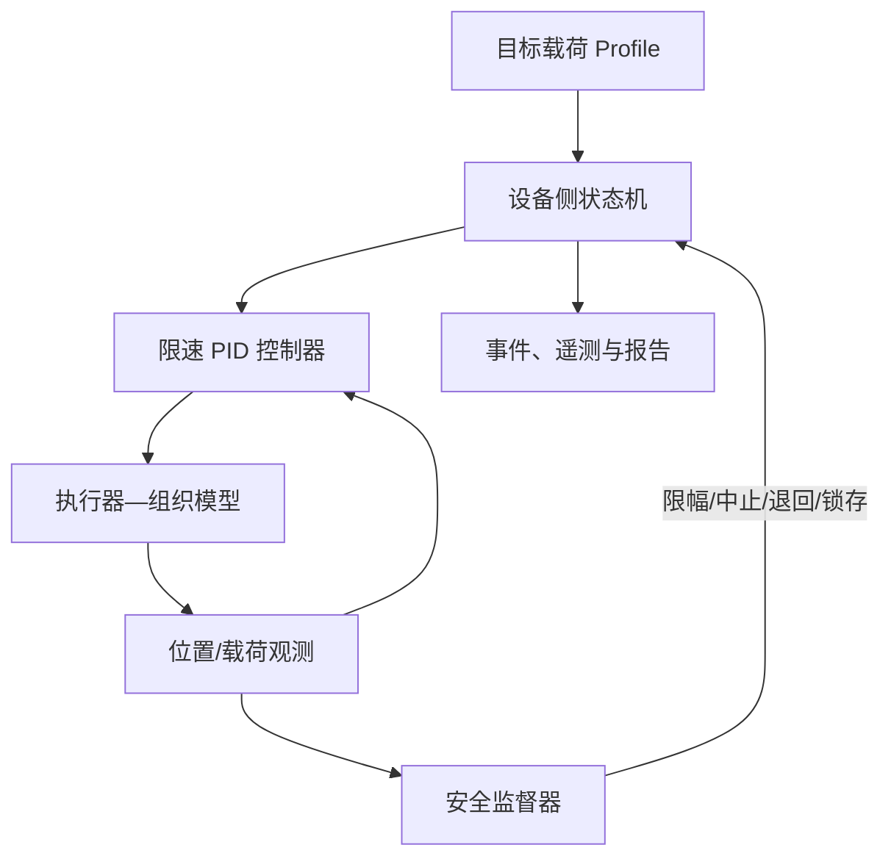

# D3自动施压与安全控制数字仿真实施方案

版本：1.0.0  
状态：实施基线；本文件评审合并后按顺序编码。  
关联Issue：[D3-01 实现自动施压与安全控制数字仿真](https://github.com/cxjchelsea/digital-pulse-diagnosis/issues/16)

## 1. 阶段目标

D3在不购买硬件的条件下，建立“目标载荷Profile—执行器/软组织模型—闭环控制—本地安全监督—故障注入—确定性报告”的完整数字控制链。

D3需要证明：

1. 控制器在冻结的模型参数范围内能够完成接近、接触、稳态、采集、换挡和释放；
2. 控制命令受位置、速度、载荷、变化率和状态权限共同约束；
3. 急停、超限、传感器失效、卡滞、限位、通信失联和看门狗故障产生确定、可审计的安全响应；
4. ABORT、安全监督和退回逻辑位于设备侧模拟边界，不依赖Web或分析结果；
5. 控制器饱和、状态超时和异常重入不会造成持续加压或积分失控；
6. 相同配置、故障、种子和版本能够逐字段重放同一报告；
7. D3输出可以冻结H1接口和待实测参数清单，但不能替代真实台架安全验证。

## 2. 证据边界

D3证明的是软件控制与失效逻辑在定义模型中的行为，不证明：

- 任何人体安全载荷、接触面积或组织力学参数；
- 真实电机推力、速度、制动、回程和断电行为；
- 丝杆间隙、摩擦、结构柔性、振动和真实释放时间；
- 真实限位、急停、看门狗、电源或传感器诊断可靠性；
- 医疗安全、临床有效性或脉象结论。

D3单位统一使用：

- 位置：`position_au`
- 速度：`velocity_au_s`
- 载荷：`force_au`
- 电机命令：无量纲 `[-1, 1]`
- 时间：秒

所有安全阈值都是“模型阈值”，字段名必须带`_au`，禁止写成N、g、mmHg或人体安全上限。

## 3. 系统边界



职责边界：

| 模块 | 负责 | 不负责 |
|---|---|---|
| 上位机/API/Web | 下发Profile、显示状态、请求ABORT、读取报告 | 最终安全判断、急停执行 |
| 设备侧模拟器 | 状态机、控制器、安全监督、看门狗、退回 | 医学分析 |
| 被控对象 | 执行器、接触、顺应性、摩擦、延迟和传感观测 | 声称真实人体参数 |
| D2分析链 | 质量和压力响应 | 覆盖D3安全监督结果 |

## 4. 时间基准与确定性

首版采用固定离散时基：

| 项目 | 默认值 | 规则 |
|---|---:|---|
| 仿真积分周期 | 1 ms | 固定步长，不使用墙钟时间 |
| 控制周期 | 10 ms | 每10个积分步执行一次 |
| 遥测周期 | 4 ms | 对应250 Hz协议节奏 |
| 上位机心跳 | 100 ms | 超时阈值由安全配置冻结 |
| 随机性 | 显式seed | 噪声和故障均由同一随机源派生 |

调度基于整数tick，禁止依赖线程调度或系统时间决定数值结果。相同输入必须生成相同事件序列、遥测摘要和报告哈希。

## 5. 被控对象模型

### 5.1 状态

最小状态向量：

[
mathbf{x}=[p, v, f, z]
]

其中：

- (p)：执行器位置；
- (v)：执行器速度；
- (f)：接触载荷；
- (z)：用于迟滞/松弛的内部状态。

### 5.2 执行器

首版使用带一阶驱动滞后、速度/加速度限制和摩擦死区的模型：

[
	au_vdot v = K_u u-v-F_{friction}(v)
]

[
dot p=v
]

命令(u)限制在([-1,1])。位置到达上下模型限位后不得继续向限位外运动。

### 5.3 接触与软组织

接触前(p<p_c)时(f=0)。接触后使用可配置的非线性弹簧—阻尼模型：

[
delta=max(p-p_c,0)
]

[
f=k_1delta+k_2delta^2+cmax(v,0)+z
]

内部状态用于模拟松弛和迟滞：

[
	au_zdot z=hdelta-z
]

参数必须有限、非负并带版本；配置非法时仿真不得启动。D3至少覆盖低/中/高顺应性、摩擦、延迟和迟滞组合。

### 5.4 观测模型

真实状态与控制器观测分离：

- 位置量化、噪声、偏置、冻结和断线；
- 载荷噪声、漂移、饱和、冻结、断线和延迟；
- 电机电流代理量，用于卡滞检测；
- 上下限位与急停数字输入。

传感器无效时不得以最后一个载荷值继续闭环加压。

## 6. 控制器

### 6.1 控制结构

采用位置外约束下的离散载荷PID：

[
e_k=r_k-y_k
]

[
u_k=operatorname{sat}(K_pe_k+I_k+K_drac{e_k-e_{k-1}}{Delta t})
]

目标(r_k)必须经过斜坡限制，控制输出还需经过：

1. 状态权限；
2. 最大速度；
3. 最大加压速率；
4. 位置软限位；
5. 载荷软限位；
6. 安全监督器最终裁决。

### 6.2 抗积分饱和

首版使用条件积分加回算：

- 输出未饱和时正常积分；
- 输出饱和且误差推动其继续饱和时暂停积分；
- 用(K_{aw}(u_{sat}-u_{raw}))回算；
- 离开STABILIZE/ACQUIRE或进入安全态时清零积分；
- 任何NaN/Inf立即阻断控制。

不在D3使用自动整定或机器学习控制器。参数先由确定性模型扫参获得，再冻结到配置和报告。

### 6.3 稳态判据

连续窗口同时满足才视为稳定：

- (|f-r|le tolerance_force_au)；
- (|df/dt|le tolerance_rate_au_s)；
- 无安全故障；
- 传感器有效；
- 持续达到`min_stable_s`。

状态枚举不能替代数据判据。进入ACQUIRE后若稳定性失效，立即退出正式采集并按配置返回STABILIZE或中止。

## 7. 状态机

D3冻结以下状态：

| 状态 | 主要行为 | 允许的主动运动 |
|---|---|---|
| BOOT | 初始化 | 否 |
| SELF_TEST | 校验配置、传感器、限位和看门狗 | 仅受限自检 |
| IDLE | 等待任务，积分清零 | 否 |
| APPROACH | 低速寻找接触 | 仅加压方向、限速 |
| CONTACT | 确认接触和载荷通道有效 | 受限 |
| STABILIZE | 闭环跟踪当前目标 | 双向、受安全限幅 |
| ACQUIRE | 保持目标并产生有效窗口 | 双向、较低限速 |
| STEP | 切换下一目标 | 受限 |
| RETRACT | 设备侧退回 | 仅卸载方向 |
| SAFE_HOLD | 禁止继续加压，等待可执行的退回条件 | 否 |
| FAULT_LATCHED | 故障锁存，需显式复位和自检 | 否 |

正常终点：`RETRACT → IDLE`。异常终点必须是`IDLE`、`SAFE_HOLD`或`FAULT_LATCHED`之一，禁止停留在加压状态。

重要修正：真实急停通常会切断驱动，不能笼统承诺“急停后主动退回”。D3必须区分：

- ABORT、上位机失联、一般超限：执行器和位置观测可用时受控RETRACT；
- 急停：立即禁止驱动，进入SAFE_HOLD/FAULT_LATCHED，依赖未来硬件的被动释放或人工释放设计；
- 电机卡滞：不得假设同一执行器仍能可靠退回；
- 载荷传感器断线：禁止加压；仅在位置通道有效时允许受限位置退回。

D3-A实现时必须同步修订《设备状态机与安全设计》和《系统架构》中的过度简化表述。

## 8. 安全不变量

下列条件必须在每个控制tick检查，并由测试直接验证：

1. 非APPROACH/STABILIZE/ACQUIRE/STEP状态不得输出正向加压命令；
2. RETRACT不得输出正向命令；
3. 急停有效时电机命令恒为0；
4. 载荷超过硬模型上限时不得继续增加压缩；
5. 上限位有效时不得向加压方向运动；
6. 下限位有效时不得向退回方向运动；
7. 载荷传感器无效时不得进行载荷闭环加压；
8. 看门狗或通信超时后不得继续执行当前Profile；
9. FAULT_LATCHED只能经显式RESET和SELF_TEST退出；
10. 任意NaN/Inf、非法枚举或时间倒退必须安全终止；
11. 安全事件不可被普通START/SET_TARGET命令清除；
12. Web断开或崩溃不能阻止设备侧安全响应。

## 9. 故障优先级与响应

同一tick多个事件按以下优先级处理：

1. 急停；
2. 配置/数值非法和状态机不变量破坏；
3. 载荷硬超限；
4. 限位冲突；
5. 关键传感器断线/冻结；
6. 电机卡滞；
7. 看门狗超时；
8. 上位机心跳超时；
9. 状态超时或无法稳定；
10. 数据质量问题。

| 故障 | 检测 | 首要动作 | 目标状态 |
|---|---|---|---|
| emergency_stop | 数字输入 | 命令清零并锁存 | SAFE_HOLD/FAULT_LATCHED |
| hard_overload | 载荷阈值 | 禁止加压；条件允许则退回 | RETRACT或FAULT_LATCHED |
| upper_limit | 限位输入 | 禁止正向运动 | RETRACT或FAULT_LATCHED |
| lower_limit | 限位输入 | 禁止反向运动 | IDLE或FAULT_LATCHED |
| limit_conflict | 上下限位同时有效 | 命令清零 | FAULT_LATCHED |
| force_disconnect/frozen | 有效位、变化与心跳 | 禁止载荷闭环；位置有效则退回 | RETRACT或FAULT_LATCHED |
| position_disconnect | 有效位 | 命令清零 | FAULT_LATCHED |
| motor_stall | 命令、速度、电流代理 | 命令清零并锁存 | FAULT_LATCHED |
| host_timeout | 心跳 | 中止Profile并本地退回 | RETRACT |
| watchdog_timeout | 调度故障 | 输出归零并重启/锁存 | FAULT_LATCHED |
| never_stable | 状态超时 | 当前步骤失败；按策略退回 | STEP或RETRACT |
| motion_artifact | D2质量 | 窗口无效，不冒充安全故障 | STABILIZE/ACQUIRE |

所有事件至少记录：tick、设备时间、来源、优先级、原状态、动作、目标状态、观测快照和锁存状态。

## 10. 配置与Schema

建议新增：

- `protocols/d3-plant.schema.json`
- `protocols/d3-controller.schema.json`
- `protocols/d3-safety.schema.json`
- `protocols/d3-scenario.schema.json`
- `protocols/d3-report.schema.json`

配置记录必须含：

- `schema_version`、唯一ID和内容SHA-256；
- 仿真、控制和遥测周期；
- 被控对象参数及模型版本；
- PID、限幅、斜坡和抗饱和参数；
- 模型软/硬阈值；
- Profile和故障时间线；
- 随机种子；
- 代码/协议/算法版本。

配置在一次运行中不可变；修改必须生成新ID。

## 11. 数据与报告

建议实验目录：

```text
sessions/d3-control/<report_sha256>/
├── scenario.json
├── plant.json
├── controller.json
├── safety.json
├── events.jsonl
├── telemetry.jsonl
└── report.json
```

报告至少包含：

- 输入配置及各自哈希；
- 初始条件、seed和版本；
- 完整状态转移时间线；
- 故障注入与检测延迟；
- 每步上升时间、超调、稳态误差、稳定时间；
- 命令饱和时间、积分最大值和抗饱和证据；
- 最大载荷、最大位置、最大速度；
- ABORT/故障后的停止时间、卸载时间和最终状态；
- 每条安全不变量的通过/失败；
- Profile完成状态和失败原因；
- `analysis_allowed`与仿真边界声明；
- 规范化报告SHA-256。

报告必须由配置和确定性仿真纯派生；删除派生目录后可完整重建。

## 12. API与Web

### 12.1 API

建议新增：

- `POST /api/experiments/d3/run`
- `GET /api/experiments/d3/{report_sha256}`
- `POST /api/experiments/d3/{report_sha256}/replay`
- `POST /api/experiments/d3/{run_id}/abort`
- `GET /api/experiments/d3/{run_id}/events`

错误映射：

- 400：Schema或配置非法；
- 404：运行/报告不存在；
- 409：状态不允许、故障锁存或重复命令；
- 422：配置合法但场景不可执行；
- 500：未预期内部错误。

ABORT接口只是请求入口；安全动作必须在设备侧模拟状态机中发生。

收尾强化后的可运行会话路由（与报告 sha256 路由并存，互不冲突）：

- `POST /api/experiments/d3/runs`
- `GET /api/experiments/d3/runs/{run_id}`
- `POST /api/experiments/d3/runs/{run_id}/abort`
- `GET /api/experiments/d3/runs/{run_id}/events`

完整卸载闭环与 D3-T01…T24 证据见 `d3_closed_loop.py`、`scripts/generate_d3_acceptance.py` 与《D3阶段验收报告》。

### 12.2 Web

最小交付：

1. 正常/故障场景选择；
2. 当前状态、目标/实际载荷、位置、速度和控制命令；
3. 状态时间线与安全事件；
4. ABORT入口及设备侧响应展示；
5. 上升时间、超调、稳态误差和释放时间；
6. 故障原因、最终安全态和不变量结果；
7. 报告查询与确定性重放；
8. 固定显示“模型相对单位、非人体安全验证”。

Web不提供绕过硬阈值、清除急停或直接写电机输出的入口。收尾后 Web 正常 Profile 控制区必须调用上述 `/runs` API，不得在前端本地伪造 `RETRACT`/`IDLE`。

## 13. 性能与验收阈值

以下是D3默认模型的回归阈值，不是真实设备指标：

| 指标 | 默认通过条件 |
|---|---|
| 正常Profile完成 | 全部步骤完成并最终回到IDLE |
| 稳态误差 | 每个有效步骤(le 2.0 force_au) |
| 超调 | 相对当前阶跃幅度(le 10%) |
| 稳定时间 | 每步(le 3.0s) |
| ABORT检测 | (le 1)个控制周期 |
| host timeout检测 | 不超过配置阈值+1个控制周期 |
| 禁止加压响应 | 检测后下一控制tick命令(le0) |
| 可退回故障释放 | 配置的模型时限内到达下限位/零接触 |
| 报告重放 | 规范化内容与SHA-256逐字段一致 |
| 长时间仿真 | 30分钟模型时间，无非法状态、非有限值或无界积分 |

阈值必须存入SafetyConfig并随报告保存。H1必须重新实测，不得沿用为人体安全值。

## 14. 代码结构

建议新增或修改：

```text
src/digital_pulse/
├── d3_models.py          # 状态、配置和结果数据类
├── d3_plant.py           # 执行器、接触、组织和观测模型
├── d3_controller.py      # 目标斜坡、PID、限幅和抗饱和
├── d3_safety.py          # 不变量、故障优先级和安全裁决
├── d3_state_machine.py   # 设备侧确定性状态机
├── d3_experiment.py      # 固定tick编排、故障注入和报告
└── api.py                # D3 API

tests/
├── test_d3_plant.py
├── test_d3_controller.py
├── test_d3_state_machine.py
├── test_d3_safety.py
├── test_d3_experiment.py
└── test_api.py

web/src/
└── main.tsx或d3组件       # 状态时间线与安全面板
```

模块依赖方向固定为：模型 → 被控对象/控制器 → 安全监督/状态机 → 实验编排 → API/Web。安全模块不得依赖Web或D2分析结果。

## 15. 工作包与实现顺序

| 工作包 | 内容 | 退出条件 |
|---|---|---|
| D3-A 契约冻结 | Schema、状态、命令、错误码、不变量、事件格式 | 文档和机器可读示例一致 |
| D3-B 被控对象 | 执行器、接触、组织、观测和参数校验 | 开环响应和边界测试通过 |
| D3-C 控制器 | 目标斜坡、PID、限幅、抗饱和和稳态判据 | 正常阶跃与饱和恢复通过 |
| D3-D 安全状态机 | 状态权限、监督器、超时、锁存和复位 | 状态转移及不变量测试通过 |
| D3-E 故障矩阵 | 急停、超限、限位、传感、卡滞、失联、看门狗 | 每种故障到达规定安全态 |
| D3-F 报告/API/Web | 存储、指标、重放、ABORT、时间线 | 端到端与手动验收通过 |
| D3-G 集成验收 | 全量回归、长时间仿真、文档和验收报告 | D3退出条件全部满足 |

实现顺序固定为A→B→C→D→E→F→G。不得先做界面，也不得在安全不变量未测试前宣布控制闭环完成。

## 16. 自动测试矩阵

| ID | 场景 | 通过条件 |
|---|---|---|
| D3-T01 | 合法/非法模型配置 | 合法通过；NaN、负刚度、非法周期被拒绝 |
| D3-T02 | 无接触开环运动 | 位置/速度有限，载荷为0 |
| D3-T03 | 接触和卸载 | 接触后载荷单调响应；卸载后回零 |
| D3-T04 | 顺应性参数组 | 低/中/高组均确定性且数值有界 |
| D3-T05 | 正常单阶跃 | 超调、误差和稳定时间满足模型阈值 |
| D3-T06 | 多目标Profile | 状态顺序正确并最终IDLE |
| D3-T07 | 输出饱和 | 输出受限且积分不无界增长 |
| D3-T08 | 饱和后反向目标 | 控制器可恢复，无长时残余积分 |
| D3-T09 | 稳态失效 | ACQUIRE退出或窗口阻断 |
| D3-T10 | ABORT | 一周期内停止加压并由设备侧进入RETRACT |
| D3-T11 | 急停 | 命令立即为0，故障锁存，不承诺主动退回 |
| D3-T12 | 载荷硬超限 | 禁止继续加压；按可用能力退回或锁存 |
| D3-T13 | 上/下限位 | 禁止越界方向命令 |
| D3-T14 | 限位冲突 | 进入FAULT_LATCHED |
| D3-T15 | 载荷传感器断线/冻结 | 禁止载荷闭环；安全退回或锁存 |
| D3-T16 | 位置传感器断线 | 命令归零并锁存 |
| D3-T17 | 电机卡滞 | 检测后命令归零并锁存 |
| D3-T18 | 上位机失联 | 设备侧超时并受控RETRACT |
| D3-T19 | 看门狗超时 | 输出归零并进入规定故障流程 |
| D3-T20 | 同tick多故障 | 按冻结优先级处理并记录全部事件 |
| D3-T21 | 相同输入重放 | 时间线、指标、报告和哈希一致 |
| D3-T22 | 30分钟模型时间 | 无非法状态、非有限值、无界积分或缓冲异常 |
| D3-T23 | D0–D2回归 | 原有测试全部通过 |
| D3-T24 | API/Web | 错误映射、生产构建和手动验收通过 |

## 17. 手动验收

1. 启动后端和前端，确认D3单位均为`*_au`；
2. 运行正常多目标Profile，观察状态、目标/实际载荷和控制命令；
3. 核对超调、稳态误差、稳定时间与最终IDLE；
4. 在STABILIZE发出ABORT，确认设备侧进入RETRACT；
5. 注入急停，确认命令归零并锁存，界面不声称主动退回；
6. 分别注入超限、传感器断线、卡滞、限位冲突、host timeout和watchdog；
7. 核对每个场景的事件优先级、最终状态和不变量结果；
8. 使用相同场景重放，确认报告哈希一致；
9. 确认普通命令无法清除锁存故障；
10. 确认页面和报告没有人体安全或真实硬件性能结论。

## 18. D3退出条件

必须全部满足：

- D3-T01至D3-T24通过；
- D0–D2全量回归无失败；
- 安全不变量具有直接自动测试；
- 所有冻结故障到达规定的IDLE、SAFE_HOLD或FAULT_LATCHED；
- 正常Profile满足D3模型回归阈值；
- 相同输入确定性重放一致；
- API、Web生产构建和手动验收通过；
- D3验收报告记录测试数、结果、代码SHA和限制；
- 《设备状态机与安全设计》《系统架构》《README》与最终实现一致；
- 所有真实硬件未知量进入H1待测参数清单。

## 19. H1前仍待回答的问题

D3完成后仍不能由仿真回答：

- 真实执行器能否在断电/急停后被动释放；
- 电机、丝杆、弹簧和探头的最大载荷及失效模式；
- 真实力传感器量程、噪声、漂移、冻结与断线判据；
- 真实位置/限位冗余和制动距离；
- 人体接触面积、舒适度和安全载荷；
- 真实控制频率、通信延迟和释放时间；
- EMI、电源、温升和机械夹伤风险。

H1采购清单必须让每个器件对应至少一个上述不可再靠软件仿真回答的问题。

## 20. 完成定义

D3完成意味着：项目具备一个可复现、可注入故障、可审计的自动施压控制数字原型，且安全响应不依赖Web和分析模块。

D3完成不意味着：自动施压实物已经安全、H1/H3已经完成、可以进行人体自动施压实验，或可以对外宣称医疗设备性能。
