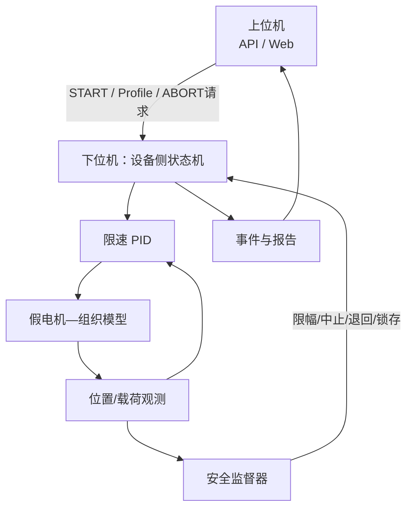

# D3 阶段设计与实现详解

版本：1.1.0
状态：说明文档（对应已通过验收的 D3 数字仿真阶段）
阅读对象：希望快速理解「D3 相对 D0–D2 多了什么」以及「为何还不能直接做人实验」的开发者与评审者

本文是理解文档，不是验收清单。执行口径以 [D3自动施压与安全控制数字仿真实施方案](./D3自动施压与安全控制数字仿真实施方案.md) 为准；验收证据见 [D3阶段验收报告](../05-验证与实验/D3阶段验收报告.md)。

---

## 1. 一句话理解 D3

**D3 = 用软件模拟一台会自动加压的下位机（假设备）：内部有电机控制，能产生可控、已知、可重复的压力；出事时能急停/退回/锁存；并与上位机及前序契约正确对接。**

心智模型可以记成四条：

1. **核心是假自动加压设备**（角色上就是下位机，不是上位机）；
2. 压力要**可控、已知、可重复**（单位仍是合成 `force_au`）；
3. **安全在设备侧**：急停、退回、锁存不依赖网页；
4. **设备内部有控制**：状态机 + PID + 假电机/接触模型形成闭环。

它回答的不是「真电机安不安全」，而是：

> 在冻结的数字模型里，下位机能不能自己完成接近→接触→稳态→采集→换挡→释放？
> 急停、超限、断线、卡滞、失联等故障，会不会落到确定、可审计的安全动作？
> 上位机是否只负责指挥与查看，而最终安全执行留在设备侧？

对照前三阶段：

| | D0 | D1 | D2 | D3 |
|---|---|---|---|---|
| 核心问题 | 上位机内部会不会处理帧 | 上位机会不会跟下位机说话 | 上位机会不会按标定理解压力 | **下位机会不会自动加压，出事会不会安全停** |
| 数据/模型 | 合成波形 | 假串口通信 | 合成标定 `*_au` | **假执行器—组织模型 + 设备侧控制/安全** |
| 主要增量 | 落盘/质控/显示 | 传输层与命令 | 标定与多压力实验 | **被控对象、PID、状态机、安全监督、故障矩阵** |
| 是不是真硬件 | 否 | 否 | 否 | **仍否** |

```text
上位机（电脑软件：API / Web）
  │  下发 Profile / START / ABORT 请求；查看状态与报告
  ▼
下位机 / D3 假设备
  ├── 状态机（现在采还是退回）
  ├── PID 控制器（怎么追目标压力）
  ├── 假电机 + 接触模型（压力怎么产生）
  └── 安全监督（急停 / 受控退回 / 锁存）
```

与前序的关系（容易误解）：

- D1 像「电话线怎么通话」；D3 像「电话那头怎么操作机器」；
- D2 提供 `force_au` 等相对单位语义；D3 用它们做控制与安全仿真；
- **不是**把 D3 简单再塞进 D0 旧分析流水线一遍，而是契约/单位/命令对齐后的设备侧能力扩展。

常见误解：

- ❌「D3 通过就可以自动往手腕上加压」→ 只允许进入 H1 采购与台架，不能直接人体自动施压
- ❌「`force_au` 阈值是人体安全上限」→ 只是模型阈值
- ❌「安全可以由网页按钮保证」→ 安全闭环必须在设备侧
- ✅「D3 练的是：假下位机能否产生可控可重复压力，并在故障时确定地安全停下，且可重放」

---

## 2. 上位机、下位机与「这台设备」

| 称呼 | 是谁 | D3 中的落点 |
|---|---|---|
| **上位机** | 电脑上的软件 | FastAPI、Web：下发实验、显示时间线、存/查/重放报告 |
| **下位机 / 设备** | 将来的 MCU+电机+传感器；现在用软件假装 | 状态机、PID、安全监督、假电机/软组织模型 |
| 你说的「自动加压设备」 | 就是下位机这一侧 | 不是上位机 |

谁听谁的：

- **日常**：上位机发开始与目标台阶 → 下位机自己加压、稳住、换挡、退回；
- **安全**：下位机本地决定急停/退回/锁存；不等网页确认；
- 上位机可以**请求** ABORT，真正执行在设备侧。

将来 H1/H3 换成真 MCU、真电机时：上位机尽量仍是现有软件；下位机从「Python 假设备」换成「真固件 + 真机构」；上下位机关系不变。

---

## 3. 在路线中的位置

| 阶段 | 核心问题 | 状态 |
|---|---|---|
| D0–D2 | 数据闭环、通信、标定实验 | 已完成并合并 |
| **D3** | **自动施压与安全控制数字仿真** | **已完成并验收** |
| H1 | 真实硬件采购与手动单点台架 | 下一步 |

D3 是购买前数字扩展的最后一关：通过后冻结 H1 接口与待实测参数，**不能替代真实台架安全验证**。

---

## 4. 阶段目标与非目标

### 4.1 目标（方案冻结）

1. 控制器能在模型内完成接近、接触、稳态、采集、换挡、释放；
2. 命令受位置/速度/载荷/变化率/状态权限约束；
3. 急停、超限、传感失效、卡滞、限位、失联、看门狗等有确定安全响应；
4. ABORT/安全/退回在**设备侧**，不依赖 Web 或分析结果；
5. 饱和、超时、异常重入不会持续加压或积分失控；
6. 同配置/故障/种子可逐字段重放同一报告；
7. 输出可服务 H1 接口冻结，但不替代实物安全验证。

### 4.2 非目标

- 人体安全载荷、真实接触面积、真实组织力学；
- 真实电机推力、制动、断电释放、丝杆间隙与振动；
- 真实限位/急停/看门狗硬件可靠性；
- 临床、诊断、脉象结论。

单位：`position_au` / `velocity_au_s` / `force_au`，电机命令无量纲 `[-1, 1]`。阈值字段名带 `_au`。

---

## 5. 系统怎么串起来

下位机内部是一条控制闭环；上位机挂在外侧做实验编排与展示：



职责边界（很重要）：

| 模块 | 负责 | 不负责 |
|---|---|---|
| 上位机 / API / Web | 下发实验、显示、请求 ABORT、读报告 | 最终安全判断、急停执行 |
| 下位机（设备侧模拟） | 状态机、PID、安全监督、看门狗、退回 | 医学分析 |
| 被控对象（下位机内部） | 假电机、接触、摩擦、观测噪声 | 声称真实人体参数 |

原则：**网页坏了也不能阻止设备侧卸载**；D3 在软件里把这条原则先钉死。

---

## 6. 按子阶段实际交付了什么

D3 按 D3-A → D3-G 落地：

| 子阶段 | 交付 | 代码/产物 |
|---|---|---|
| **D3-A** | 控制与安全契约：状态、命令、故障码、优先级、合法迁移、schema | `d3_contracts.py`，`protocols/d3-*.schema.json`，`examples/d3/` |
| **D3-B** | 被控对象与观测：位置/速度/载荷、摩擦延迟、传感噪声与故障 | `d3_plant.py` |
| **D3-C** | 限速 PID、目标斜坡、抗积分饱和、稳态判据 | `d3_controller.py` |
| **D3-D** | 设备侧安全监督器 + 确定性状态机 | `d3_safety.py`，`d3_state_machine.py` |
| **D3-E** | 14 类故障注入矩阵与安全回归 | `d3_fault_matrix.py`，`d3_experiment.py` |
| **D3-F-A** | 报告持久化、SHA-256、查询与重放 API | `d3_api.py` |
| **D3-F-B** | Web 故障时间线与确定性重放展示 | `web/src/main.tsx` |
| **D3-G** | 植物—控制器—状态机真实集成 + 正常 Profile + 30 分钟模型时长 | `d3_integration.py` |
| **Closeout** | 完整卸载闭环、ABORT运行会话、完整链路1800s、验收证据与CI | `d3_closed_loop.py`，`d3_runtime.py`，`scripts/generate_d3_acceptance.py` |

### 6.1 状态机（通信/控制侧完整流程）

状态包括：`BOOT → SELF_TEST → IDLE → APPROACH → CONTACT → STABILIZE → ACQUIRE → STEP → RETRACT → IDLE`，以及 `SAFE_HOLD` / `FAULT_LATCHED`。
命令包括：`START` / `ABORT` / `HEARTBEAT` / `RESET`。

### 6.2 故障矩阵（14 类场景）

例如：急停、非法数值、硬过载、限位冲突、上下限位、力/位置传感失效、电机卡滞、看门狗、主机超时、状态超时、永不稳态、数据质量等。
同 tick 多故障按冻结优先级裁决；结果可确定性重放。

### 6.3 API

| 接口 | 作用 |
|---|---|
| `POST /api/experiments/d3/run` | 跑故障矩阵实验并落盘 |
| `GET /api/experiments/d3/{report_sha256}` | 取报告 |
| `GET /api/experiments/d3/{report_sha256}/events` | 取安全事件 |
| `POST /api/experiments/d3/{report_sha256}/replay` | 重放并检查哈希一致 |
| `POST /api/experiments/d3/runs` | 创建可运行正常 Profile 会话（可 `hold`） |
| `GET /api/experiments/d3/runs/{run_id}` | 查询状态/载荷/位移/命令/tick |
| `POST /api/experiments/d3/runs/{run_id}/abort` | 请求设备侧 ABORT（幂等） |
| `GET /api/experiments/d3/runs/{run_id}/events` | 会话事件与时间线 |

### 6.4 Web

- 「启动正常 Profile」→ 轮询设备侧会话 → 「ABORT」→ 观察 `RETRACT` 与卸载完成；
- 「运行 D3 矩阵」→ 展示通过数、安全事件时间线 →「确定性重放」。
Web **只请求与展示**，不直接写电机输出、不清除锁存故障、不本地伪造安全事件。

### 6.5 集成验收要点（D3-G + Closeout）

- 正常 Profile：`20/40/60 force_au`，稳态时间/误差/超调在模型阈值内，最终回 `IDLE`；
- 完整卸载：可退回故障验证停止加压、载荷下降、到达 IDLE 或按规定超时失败；
- 1800 秒完整链路：Plant + PID + Safety + Device SM + 心跳；
- 故障矩阵、ABORT API/Web 闭环、API 重放、Web 构建与验收证据生成通过。

---

## 7. 代码地图

```text
src/digital_pulse/
├── d3_contracts.py      # 状态/故障/配置契约
├── d3_plant.py          # 假执行器与观测
├── d3_controller.py     # 限速 PID
├── d3_safety.py         # 安全监督
├── d3_state_machine.py  # 设备侧状态机
├── d3_fault_matrix.py   # 故障注入与场景
├── d3_experiment.py     # 矩阵实验与报告哈希
├── d3_closed_loop.py    # 完整故障卸载闭环
├── d3_runtime.py        # 可 ABORT 的运行会话
├── d3_api.py            # REST 路由（矩阵 + runs）
└── d3_integration.py    # 闭环集成与完整链路长时回归

scripts/generate_d3_acceptance.py
.github/workflows/ci.yml
protocols/d3-*.schema.json
examples/d3/*.json
tests/test_d3_*.py
web/src/main.tsx         # 正常 Profile + 矩阵时间线 UI
```

---

## 8. D3 证明了什么，没有证明什么

### 8.1 已证明（数字环境）

- 模型内可完成多台阶自动施压流程；
- 设备侧安全动作确定、可审计；
- 14 类故障检测瞬间到达预期安全态，可退回故障完成卸载闭环；
- ABORT 经 API/Web 进入设备侧状态机并完成 Plant 卸载；
- 报告可持久化、可重放、哈希一致；
- Web 不越权控制安全；
- 完整链路 1800 秒模型时长无数值失控与误触发主机/看门狗超时。

### 8.2 未证明

- 真实电机/丝杆/限位/急停硬件；
- 真实人体安全载荷；
- 任何医学或脉象有效性。

因此：**D3 通过 ≠ 可以做人自动施压**；只打开通向 H1 采购与台架验证的门。

---

## 9. 与前序 / H1 的衔接

| 方向 | 关系 |
|---|---|
| 相对 D1 | D1 冻结上下位机怎么通信；D3 充实下位机内部怎么加压与保安全 |
| 相对 D2 | D2 冻结 `*_au` 等工程语义；D3 用它们做控制目标与模型阈值 |
| 相对 D0 | 上位机仍负责展示与落盘报告；不把安全判断交给分析流水线 |
| 进入 H1 | 下位机从 Python 假设备换成真实 MCU/传感器；上位机与契约尽量复用 |
| 不可跳过 | H1 台架与仿体/渐进安全验证，才能谈后续自动施压实物（H3） |

---

## 10. 阅读路径

1. [D0](./D0阶段设计与实现详解.md) / [D1](./D1阶段设计与实现详解.md) / [D2](./D2阶段设计与实现详解.md)：前序边界；
2. 本文：D3 = 假下位机自动加压 + 设备侧安全；
3. [D3自动施压与安全控制数字仿真实施方案](./D3自动施压与安全控制数字仿真实施方案.md)：完整规格；
4. [D3阶段验收报告](../05-验证与实验/D3阶段验收报告.md)：通过证据与禁止事项；
5. 分子设计：`docs/03-信号处理/D3*.md`、`docs/04-软件分析/D3-F-*.md`。

---

## 11. 总结

| 维度 | 结论 |
|---|---|
| D3 本质 | 模拟会自动加压的下位机：可控可重复压力 + 设备侧安全 |
| 上下位机 | 上位机指挥与查看；下位机加压与安全执行 |
| 仍保留 | 无真硬件；单位为 `*_au` |
| 真正增量 | 被控对象、PID、状态机、安全监督、故障矩阵、可重放报告与 Web 时间线 |
| 心智模型 | D0 会处理帧；D1 会跟下位机说话；D2 会标定理解压力；D3 下位机会加压且出事能安全停 |
| 当前状态 | 已验收通过；下一阶段 H1 |
| 边界 | 数字通过 ≠ 人体/真实机械安全 |
