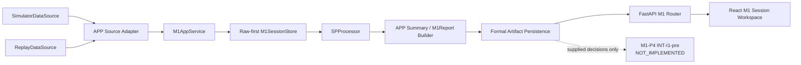

# M1-P3 APP-A1-pre分析软件预实现实施方案

版本：0.1.0

状态：规划完成，待单独授权进入 M1-P3A

规划基线：`5a924289e912f60c448a399c01d3bf7dd916d505`

## 1. 阶段定位

M1-P3 位于已合并并验证的 M1-P2 SP-S1-pre 之后、尚未开始的 M1-P4 INT-I1-pre 之前。它建立 APP-A1-pre 的会话编排、持久化、重放、质量门控、报告组装、API 和前端展示能力，只证明合成数据链路的软件行为。

本阶段是预实现，不代表 M1-PV、H1、真实硬件、人体、临床或医学用途通过。当前证据必须持续标记为 simulation only、not hardware validated、not for medical use、pending H1 calibration。

## 2. 当前已完成基线

权威 main 为 M1-P2 merge commit `5a924289e912f60c448a399c01d3bf7dd916d505`。M1-P0 契约、M1-P1 Recorder/Replay 和 M1-P2 `SPProcessor` 已存在，M1-P2 状态为 `MERGED_AND_VERIFIED`。

规划分支创建前的基线验证：

| Gate | 结果 |
|---|---|
| M1 SP | 124 passed + 3 subtests |
| M1 simulator | 93 passed + 65 subtests |
| pytest | 433 passed + 84 subtests |
| unittest | 290 tests, OK |
| D3 formal acceptance | PASS，`failed_gates=[]` |
| M1-P1 acceptance | PASS |
| M1-P2 acceptance | PASS，44/44 gates |
| Web production build | PASS |
| main CI | `31448734603` success，head 为规划基线 |

## 3. P3 范围

P3 覆盖 Issue #29 中七项 APP checklist：多通道模拟会话；原始事实优先落盘与完整重放；原始/处理波形、载荷、PPG 和质量时间线；基础心率、逐搏和质量摘要；失败与不完整状态；质量失败阻断正式参数；版本追溯与后续 M1-PV 可消费的预验收证据。

后端范围是统一 APP 数据源边界、会话 lifecycle、raw-first 持久化、artifact index、SP 编排、语义重放和 `M1Report` 组装。前端范围是 session workspace、三通道波形、质量/窗口/逐搏、失败、证据标签和 provenance。报告范围是冻结 `M1Report` 的 schema-valid 实例。

## 4. 明确非范围

- 不生成 `M1Decision`，不选择 accept/retry/reposition/stop，不实现 retry 次数或 operator override 规则。
- 不实现 M1-P4 INT-I1-pre、不启动 P5/PV。
- 不实现串口或真实 `HardwareDataSource`，只保留接口兼容点。
- 不改变 SP 算法、阈值、参数、fingerprint 或 golden。
- 不输出脉象、血压、血管硬度、中医证型或任何医学解释。
- 不重写 FastAPI/React 栈，不删除既有 D1/D2/D3 页面。

APP 的 abort 只是停止当前 APP 会话、保全事实并形成 blocked closeout；它不是 INT action `abort_and_release`。

## 5. Frozen contracts

以下为冻结边界，P3 默认语义变更数为 0：

- `src/digital_pulse/m1_contracts.py`
- `protocols/m1-sample.schema.json`
- `protocols/m1-session.schema.json`
- `protocols/m1-quality.schema.json`
- `protocols/m1-decision.schema.json`
- `protocols/m1-report.schema.json`

正式模型必须复用 `M1Session`、`M1QualityResult`、`M1Decision`、`M1Report`、`SessionFileRef` 和 `FileRole`。内部 API/view model 可以存在，但不能成为竞争性正式契约。若实现无法满足这些冻结结构，立即以 `M1_P3_CONTRACT_GAP_REQUIRES_REVIEW` 停止。

## 6. Existing component reuse map

| 现有组件 | P3 用法 | 禁止事项 |
|---|---|---|
| `api.create_app()` | 保留 app factory，include 一个薄 M1 router | 把 orchestration 继续堆入 `api.py` |
| `create_d3_router()` | 作为 router 分离风格先例 | 修改 D3 路由语义 |
| `M1SessionRecorder` | 复用 session 建立、原子写、partial failure、manifest 语义 | 建第二套 simulator recorder |
| `ReplayDataSource` | 从 manifest 的 `FileRole.SAMPLES` 读取并校验完整/非完整会话 | 仅加载旧 report 冒充 replay |
| path helpers | 复用 identifier、contained child/file 校验 | 接受客户端文件系统路径 |
| `SPProcessor` / `SPProcessingResult` | 唯一正式 SP 入口及语义结果 | 调 private P2 internals 或绕过 gate |
| `M1Report` | 唯一正式 report persistence contract | 新建 `AppReport`/`FinalReport` |
| `web/src/main.tsx` / `style.css` | 保留 D1/D2/D3，并引入独立 M1 workspace | 重写框架或移除既有 UI |

现有 P1 session 根目录为 `<session_id>/manifest.json`、`samples.jsonl`（失败时 `samples.partial.jsonl`）、`events.jsonl`；simulator-only 的 `scenario.json`、`expected.json` 是验收辅助文件，不声明为正式 M1 FileRole。

## 7. APP architecture

实现期采用薄 router + application service + storage service：

- `m1_app/router.py`：HTTP 校验、状态码、响应 view model。
- `m1_app/service.py`：`M1AppService`，会话 orchestration 与状态转换。
- `m1_app/store.py`：`M1SessionStore`，server-controlled root、原子写与 artifact index。
- `m1_app/reporting.py`：冻结 `M1Report` builder 与 report semantic payload。
- `m1_app/views.py`：非正式 UI/API view model 与 bounded waveform projection。

名称在 OD-P3-002 中锁定；上述文件只在 P3A/P3B/P3C 实现，本规划任务不创建。



## 8. Data source adapter

内部 `M1AppDataSource` protocol 提供：显式 `source_type`、正式 `M1Session` 元数据、可迭代 `M1Sample`、可选 source-native raw bytes/events、关闭/中止钩子。P3 只提供 simulator 和 replay adapters；hardware 仅作为未来 interface-compatible 类型，不创建串口代码。

`source_type` 在创建请求中必填，只接受 `simulator` 或 `replay`。Simulator adapter 持久化 `M1Sample` 原始采集事实后才允许 SP；不会为 UI 伪造不存在的 wire frame。若上游确实提供 source-native raw bytes，则以 `RAW_FRAMES` 保存；角色不存在时不得制造假 binary artifact。

## 9. Session lifecycle

APP 运行时状态是非正式 orchestration view，映射到冻结字段而不形成第二个 authoritative 状态机：

| APP view | `M1Session` | `M1Report` |
|---|---|---|
| CREATED | 尚未开始采样；manifest skeleton/creation record | 无 |
| RUNNING | `completed=false` 的运行中 view，不发布最终 manifest | 无 |
| COMPLETED | `completed=true`、`completion_reason=null` | `complete` 或 `manual_review_required` |
| INCOMPLETE | `completed=false` + 合法 completion reason | `incomplete` |
| ABORTED | `completed=false` + `manual_stop`/`abort` 映射 | `aborted` |
| FAILED | `completed=false` + failure reason | `failed` |

任何 terminal transition 都必须幂等关闭资源、flush 已有事实、原子发布最终 manifest，并尽可能生成 blocked report。并发 run/abort 使用每 session 锁，terminal session 不允许再次 run。

## 10. Raw-first persistence

处理顺序锁定为：创建隔离 session directory → 打开 partial artifact → 对每个输入事实先校验并 append/flush → 更新 persistence evidence → 才把同一事实送入下游 SP buffer。只有完整结束后才把 `samples.partial.jsonl` 原子 rename 为 `samples.jsonl`。

raw/sample persistence failure 立即停止新增分析，session 标记 incomplete/failed，`analysis_allowed=false`，objective parameters 为空。已写事实、events、failure summary 和 partial artifact 尽可能保留；禁止只返回 HTTP 500 后丢失上下文。

## 11. Artifact/file-role layout

authoritative layout 兼容 P1 的扁平核心文件，P3 仅增加冻结 FileRole 已允许的路径：

```text
<server-root>/<session_id>/
├── manifest.json
├── samples.jsonl | samples.partial.jsonl
├── events.jsonl
├── raw/frames.bin                  # 仅 source 提供真实 raw bytes 时存在
├── processed/quality.jsonl
├── processed/beats.jsonl
├── decisions.jsonl                 # 仅外部/P4 提供记录时存在
└── report.json
```

manifest 通过原子替换发布最终 `SessionFileRef` 集；每个正式 role 最多一个引用。波形 downsample/cache 放在 server cache root，不进入 manifest，不伪装为正式 artifact。

| Artifact | Producer | Consumer | Formal? / FileRole |
|---|---|---|---|
| raw frames | source adapter（仅真实可用时） | store/recovery | 是，`RAW_FRAMES`；可选 |
| samples | Recorder/APP source adapter | Replay/SP/UI projection | 是，`SAMPLES` |
| events | Recorder/APP lifecycle | APP/UI/audit | 是，`EVENTS` |
| quality | SP result projector | report/UI | 是，`QUALITY` |
| beats | SP result projector | HR/report/UI | 是，`BEATS` |
| decisions | 未来 P4 或外部正式 INT | P3 store/display/report | 是，`DECISIONS`；P3 不生产 |
| report | M1Report builder | API/UI/M1-PV future | 是，`REPORT` |
| manifest | Recorder/SessionStore | Replay/API/audit | 是，`MANIFEST` |

## 12. SP integration

`M1AppService` 只调用公开 `SPProcessor.process(session, samples, provenance=...)`。`SPProcessingProvenance.software_commit_sha` 来自实际运行 P3 HEAD，不硬编码 M1-P2 merge SHA。

必须追踪：processing `0.4.0-p2d`、parameter `0.3.0-p2c`、configuration digest `b71d02832551f5236f34ecb3ce866bb50df3420530fd3bfc8b0b17a583274371`、fingerprint `sp-result-fingerprint:v2`。P2A/B/C digest 和 P2D golden 保持冻结。

## 13. Quality gating

首版 fail closed。仅当 session 完整、raw persistence 为 `ok`、SP status 为 `quality_evaluated`、至少一个正式 quality result、所有用于 objective 的选择窗口 primary label 为 `acceptable`，且不存在 blocking code 时，`analysis_allowed=true`。

以下一律 false：`blocked_before_quality`、data integrity failure、无 quality、raw persistence failed/partial、SP exception，以及 weak/no_contact/saturated/motion/unstable/insufficient/reference mismatch/manual review。false 时 `objective_parameters` 必须为 `None` 或 `{}`，不得保留任何非空正式值。

## 14. Basic objective parameters

正式 `M1Report.objective_parameters` 首版只写冻结 schema 已允许的：

- `heart_rate_bpm`：来自 P2 validated beat intervals 的稳健中心间期，绝不调用新 detector。
- `beat_count`：来自选定 P2 quality/window beat result。
- `valid_duration_s`：来自对应正式 quality/window。

`ppg_match_rate` 不在冻结 report objective schema 中，因此只存在于 quality artifact/API presentation，不写 objective。`pulse_amplitude_raw` 首版不输出，避免引入未锁定聚合定义。

HR 仅在 `analysis_allowed=true` 且有效间期数量满足实现期锁定的最低可用条件时计算；否则为 `null`，并由 blocking reason 解释。绝不显示 `0 bpm`。

## 15. Replay semantics

正式 replay 是 persisted manifest + samples/events/raw facts → `ReplayDataSource` → 同一个 `SPProcessor` → 同一个 report builder。读取旧 `report.json` 只能用于比较，不能作为 replay 计算结果。

original 与 replay 必须一致：SP semantic `result_sha256`、quality、beats、HR、`analysis_allowed`、objective parameters、report business-semantic payload、limitations、version/config references。重放时送入 `SPProcessor` 的 session/sample source provenance 保持原 manifest 的 `simulator`，因此不能仅因执行方式是 replay 而改变 SP hash；APP view 与重放生成的 `M1Report.source_type` 明示 `replay`。report comparator 将 `source_type` 作为允许且必须核对的 execution-provenance 差异，除此之外 business-semantic payload 必须相等。

`generated_at_utc` 是运行时 wall clock，不要求 bitwise equality。P3B 定义显式 report semantic payload，排除 `generated_at_utc`、report container id、文件路径等运行时身份；是否持久化其 hash 由 OD-P3-004 锁定为 P3B 必做的内部/验收字段，不扩冻结 `M1Report`。

## 16. M1Report assembly

唯一正式报告类型是 `M1Report`。builder 输入为 `M1Session`、`SPProcessingResult` 和可选的既有 `M1Decision` records。

- `quality_summary`：primary label、排序稳定的 reason codes、window ids。
- `integrity_summary`：冻结字段投影。
- `objective_parameters`：遵循 fail-closed gate。
- `limitations`：simulation 至少包含 `synthetic_input`、`pending_h1_calibration`、`not_hardware_validated`、`not_for_medical_use`。
- `version_manifest`：protocol/calibration/SP/decision/software/config；P4 前 decision version 为 null。
- `failure_summary`：terminal failure 的稳定摘要，无 failure 时 null。

P4 前 `decision_summary` 固定为 schema-valid：`{"final_action": null, "decision_ids": [], "reason_codes": ["int_i1_pre_not_implemented"]}`。若外部提供并通过 `M1Decision` schema 的 records，P3 只能持久化和展示，并据记录组装 summary，不能自行选择 action。

## 17. API design

namespace 锁定为 `/api/m1`，以 `create_m1_app_router(service)` include 到既有 `create_app()`：

| Method | Path | 用途 |
|---|---|---|
| POST | `/api/m1/sessions` | 显式 source_type 创建 session |
| GET | `/api/m1/sessions` | bounded/paginated 列表 |
| GET | `/api/m1/sessions/{session_id}` | lifecycle、provenance、summary |
| POST | `/api/m1/sessions/{session_id}/run` | 运行已创建 simulator session |
| POST | `/api/m1/sessions/{session_id}/abort` | APP stop + failure-safe closeout |
| POST | `/api/m1/sessions/{session_id}/replay` | 从 persisted facts 重处理 |
| GET | `/api/m1/sessions/{session_id}/report` | schema-valid M1Report |
| GET | `/api/m1/sessions/{session_id}/artifacts` | role 列表，不暴露绝对路径 |
| GET | `/api/m1/sessions/{session_id}/waveforms` | bounded window/downsample view |

请求不得接受 `output_path`、artifact path 或 drive。所有 lookup 使用经过 identifier validator 的 `session_id` + server root；artifact 下载按 manifest role 解析并再次 containment check。不存在返回 404，非法 id 返回 400/422，冲突 lifecycle 返回 409，持久化/处理失败返回带 session id 的结构化错误且事实保留。

## 18. Frontend information architecture

保留现有 `main.tsx` 的 D1/D2/D3 能力，P3C 将其拆为现有 prototype 区和 `web/src/m1/` session workspace，不改变 React/Vite 技术栈：

1. SessionList：分页、source/status badge。
2. SessionDetail：lifecycle、完整性、failure banner。
3. WaveformPanel：raw pulse、processed pulse、load、PPG。
4. QualityTimeline：label/reasons、stable-window overlay。
5. BeatOverlay / ObjectiveSummary：beat markers、HR 或“已阻断”。
6. ProvenancePanel：code/config/schema/SP/parameter versions。
7. ReportPanel：limitations、evidence labels、artifact links。
8. SessionActions：run、abort、replay，按 lifecycle disable。
9. DecisionPanel：无 records 时明确 `INT-I1-pre not implemented`，绝不 hardcode accept。

波形 API 采用 server-side min/max bucket downsampling + time window，前端沿用 bounded SVG polyline；单请求默认不超过 2,000 点/通道，不引入大型 chart dependency。simulation/replay 标签和四项 limitations 始终可见。

## 19. Failure model

| Failure | 必须持久化 | UI/报告 | Gate |
|---|---|---|---|
| raw persistence failure | partial samples、events、manifest、failure | FAILED/INCOMPLETE | blocked |
| incomplete duration | samples/events/manifest、quality | insufficient duration | blocked |
| sensor disconnected | 已有 samples/events/integrity | integrity failure | blocked |
| data integrity failure | 已有 facts、quality evidence | integrity reasons | blocked |
| SP failure | raw facts、manifest、exception code | report failed if buildable | blocked |
| manual stop | 已有 facts、stop event | aborted/incomplete | blocked |
| abort | 已有 facts、abort event、资源 close | aborted | blocked |
| device fault | 已有 facts、fault event | failed | blocked |
| report assembly failure | session/SP artifacts、failure event | report unavailable + evidence | blocked |

所有 failure 都返回/保留 session id；敏感 stack trace 不进入 API，稳定错误 code 和 sanitized message 进入 failure summary。

## 20. Evidence/provenance

当前报告和页面必须明确：`evidence_source=simulation`（replay 时同时标识 replay provenance）、analysis status 为 `blocked` 或 `allowed_for_simulation`、`real_hardware_validated=false`、`pending_h1_calibration`。

正式 `M1Report.analysis_allowed` 仍为 bool；`allowed_for_simulation` 是 view label，不扩 schema。software SHA 来自实际运行 HEAD，configuration digest 来自 P2 result，schema/protocol/calibration/decision 版本来自冻结 manifest 或 null-safe 明确值。

P3 产出的“预验收报告”是未来 M1-PV 可消费的 session/report evidence，不是 M1-PV formal acceptance，也不宣称 M1-P/H1 ready。

## 21. Security/path boundary

- session id 仅允许现有 `[A-Za-z0-9][A-Za-z0-9._-]*` 规则，拒绝 `.`, `..`, slash、backslash、colon、UNC、control chars。
- 所有目录和 manifest relative path 必须 resolve 后仍位于 server-controlled root。
- API 从不接收绝对路径、drive letter 或任意 relative path。
- artifact role 必须唯一且来自冻结 enum；symlink/reparse containment 在实现测试中覆盖。
- 原子临时文件名由服务端生成；create 使用 exclusive semantics，防覆盖已有 session。
- list/waveform endpoint 有 pagination、点数、窗口和 payload 上限。

## 22. P3A/P3B/P3C/P3D breakdown

### M1-P3A — Session / Persistence Core

范围：source adapter、`M1AppService`/`M1SessionStore`、raw-first append、artifact index、lifecycle、abort/failure closeout。

退出：simulator lifecycle 可用；raw-first 有故障注入证明；manifest/ref 一致；incomplete/abort/failure 安全关闭；不生成 INT；contracts 0 diff。

### M1-P3B — Processing / Replay / Report

范围：公开 `SPProcessor` 集成、quality gate、HR/beat summary、完整 replay、`M1Report` builder、semantic report payload、version provenance。

退出：P2 semantics 不变；所有非 acceptable fail closed；HR 仅来自 P2；replay semantic equivalent；report schema valid；provenance 完整。

### M1-P3C — API / Frontend

范围：薄 FastAPI router、安全 artifact/waveform API、session workspace、三通道/raw-processed/quality/beat/HR/failure/provenance 展示、abort/replay control。

退出：API workflow 和 path safety tests 通过；UI 功能齐全且 evidence labels 可见；P4 panel 明确未实现；Web build PASS。

### M1-P3D — Formal Acceptance / CI / Final Review

范围：scenario/failure/replay/report gates、`generate_m1_p3_acceptance.py`、CI integration、独立 Final Review。

退出：formal P3 acceptance、deterministic replay、quality blocking、failure persistence、schema、D3/P1/P2 regression、pytest、unittest、Web、exact-head CI 全 PASS。

## 23. Testing strategy

测试层次：

- unit：lifecycle transition、identifier/path、atomic store、quality gate、HR、report projection、semantic payload。
- integration：simulator record→SP→report；abort/failure；ReplayDataSource→SP→report；API lifecycle/artifacts。
- contract：所有正式 artifact schema validation、FileRole 完整/唯一、blocked objective negative cases。
- frontend：view mapper、source/evidence labels、blocked HR、decision-not-implemented、bounded points；production build。
- regression：D3、M1-P1、M1-P2、P2 digest/golden/fingerprint、全 pytest/unittest。

必须有反例证明：raw write 失败后 SP 不运行；非 acceptable 不能产生 objective；篡改 report/manifest/path 被拒绝；仅重载旧 report 不满足 replay gate；wall clock 不影响 semantic comparison；APP 不生产 decision。

## 24. Formal acceptance design

P3D 才新增 `scripts/generate_m1_p3_acceptance.py`。计划 gates：

- `session_lifecycle_valid`
- `raw_first_persistence_valid`
- `replay_complete`
- `replay_semantic_equivalent`
- `quality_gate_valid`
- `report_schema_valid`
- `version_traceability_valid`
- `simulation_evidence_labels_valid`
- `failure_closeout_valid`
- `p2_regression_passed`
- `m1_p1_regression_passed`
- `d3_regression_passed`
- `web_build_passed`
- `semantic_fingerprint_complete`

acceptance 不包含 decision engine、retry/reposition/max retry。它只验证由外部提供的合法 decision records 可持久化/显示。报告记录 `failed_gates=[]`、exact software SHA 和每项证据，不修改 golden。

## 25. CI strategy

沿用现有 CI 两 job。Python job 在 exact source checkout 后依次保留 D3/P1/P2，并在 P3D 加入 M1-P3 generation/assert/artifact；Web job继续 `npm ci` + production build。PR 和 push 均显式核对 source SHA，formal artifacts 使用唯一名称上传。

P3A/B/C 不提前宣称 formal P3 PASS；各子阶段使用专项测试 + 全回归。只有 P3D Final Review 可把 P3 标为完成。任何 workflow 改动单独审查，不改变 D3 evidence 的 merge/push SHA 语义。

## 26. Risks/open decisions

### Architecture decisions

| ID | 决策 | 状态 |
|---|---|---|
| OD-P3-001 | 保持 P1 扁平 core layout，新增 `processed/`、可选 `raw/`、root report/decisions；manifest 为索引 | CLOSED |
| OD-P3-002 | 使用 `digital_pulse.m1_app`，分 router/service/store/reporting/views | CLOSED |
| OD-P3-003 | API namespace 为 `/api/m1` | CLOSED |
| OD-P3-004 | P3B 必须定义 report semantic payload/fingerprint；排除 wall clock，不扩 `M1Report` schema | CLOSED |
| OD-P3-005 | 保留现有 UI，P3C 拆 `web/src/m1/` workspace | CLOSED |
| OD-P3-006 | server-side min/max bucket + time window，SVG 每通道 ≤2,000 点 | CLOSED |
| OD-P3-007 | 只有 acceptable + 完整/persistence OK + 足够 P2 intervals 才输出 HR | FAIL_CLOSED |
| OD-P3-008 | P4 前 decision summary 为 null action、空 ids、`int_i1_pre_not_implemented` reason | FAIL_CLOSED |

Closed：6；Fail-closed：2；Open：0。

### Risks

| ID | 风险 | Mitigation | Verification | 状态 |
|---|---|---|---|---|
| P3-RISK-001 | `api.py` 单体化 | thin router/service split | module size/router tests | MITIGATED_BY_DESIGN |
| P3-RISK-002 | 重复 persistence | wrap/reuse Recorder semantics | layout/ref equivalence tests | MITIGATED_BY_DESIGN |
| P3-RISK-003 | APP 绕过 P2 gate | 只消费 public result + central gate | negative gate tests | MITIGATED_BY_DESIGN |
| P3-RISK-004 | blocked report 泄漏参数 | builder fail closed | schema + populated-negative test | MITIGATED_BY_DESIGN |
| P3-RISK-005 | replay 仅加载 report | raw→Replay→SP 强制链路 | tampered/deleted report test | MITIGATED_BY_DESIGN |
| P3-RISK-006 | UI 混淆真实证据 | persistent visible badges/limitations | UI assertion | MITIGATED_BY_DESIGN |
| P3-RISK-007 | P3 实现 INT | no decision producer/import boundary | static/API/acceptance test | MITIGATED_BY_DESIGN |
| P3-RISK-008 | session path traversal | identifier + containment | traversal/drive/UNC/symlink tests | MITIGATED_BY_DESIGN |
| P3-RISK-009 | wall clock 破坏 replay | semantic payload 排除 timestamp | clock mutation equality test | MITIGATED_BY_DESIGN |
| P3-RISK-010 | waveform payload 失控 | window/downsample/point limits | payload/performance tests | MITIGATED_BY_DESIGN |

Open：0；Mitigated by design：10。

## 27. Exit criteria

规划 gate 的退出条件：基线全绿；现有架构盘点完成；P0/P1/P2 reuse 明确；P4 边界锁定；session/storage/replay/report/API/UI 设计可实施；8 项 decisions 已 closed/fail-closed；10 项 risks 有 mitigation 与 verification；实现拆分和各阶段退出条件明确；repository diff 仅此 planning doc；Draft PR 保持未合并；Issue P3 仍未勾选。

规划通过后的状态只能是 `M1-P3 PLANNED_PENDING_IMPLEMENTATION`，P3A/B/C/D 均为 `NOT_STARTED`。

## 28. Stop conditions

出现下列任一条件立即停止，不通过规划门禁：main 移动；baseline 失败；冻结 contract 缺口；既有 architecture 不一致；P3/P4 边界无法表达；storage/replay/report gate 未解决；docs-only scope 被破坏。

规划成功后也必须停止，不创建 APP 模块、router、前端组件、acceptance script 或测试，不自动进入 P3A。下一步只能在单独授权后执行 `M1-P3A — Session / Persistence Core Implementation`。
