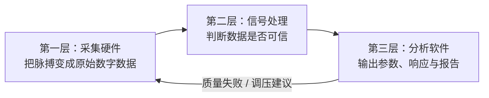
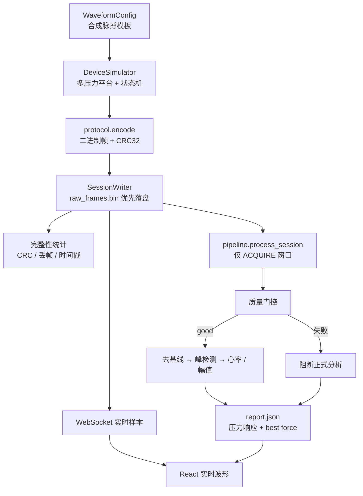
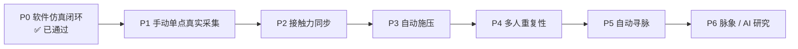

# P0 阶段设计与实现详解

版本：0.1.0  
状态：说明文档（对应已通过验收的 P0 合成环境闭环）  
阅读对象：希望快速理解「项目在做什么」以及「P0 已经真正交付了什么」的开发者与评审者

本文是理解文档，不是验收清单。执行口径以 [P0阶段实施总方案](./P0阶段实施总方案.md) 为准；验收证据见 [P0阶段验收报告](../05-验证与实验/P0阶段验收报告.md)。

---

## 1. 一句话理解本项目

本项目要建设一套**桡动脉脉搏数字化采集系统**：在已知接触压力下，稳定、可重复地采到脉搏波，先证明「数据可信」，再研究脉象与 AI。

当前仓库已完成的是 **P0：没有真实硬件时的软件闭环**。真实传感器、MCU、人体测量从 P1 才开始。

---

## 2. 总体设计：为什么是三层，而不是先做 AI

### 2.1 核心问题

在不同腕围、动脉位置、软组织厚度和佩戴状态下，怎样找到有效采集点，并在已知接触压力下得到稳定、可重复的桡动脉脉搏波？

项目刻意把「诊断」往后放。原因很直接：

- 采集不可靠时，模型学到的是噪声和佩戴差异；
- 没有质量门控时，坏数据会伪装成“结果”；
- 没有原始证据链时，实验结果无法复现、也无法反驳。

### 2.2 三层架构



| 层 | 回答的问题 | P0 中用什么代替 |
|---|---|---|
| 采集硬件 | 如何稳定数字化 | **设备模拟器**按正式协议吐帧 |
| 信号处理 | 原始数据能不能分析 | 质控、去基线、峰检测、心率、压力分段 |
| 分析软件 | 可信信号说明什么 | FastAPI + React：会话、实时图、报告 |

关键约束（贯穿全阶段）：

1. **原始数据优先**：滤波结果不能覆盖原始帧；
2. **质量不过不分析**：`no_signal` / `invalid` 时阻断正式参数；
3. **协议先行**：模拟器、未来固件、上位机共用同一份二进制协议；
4. **阶段门**：上一阶段没过，不进入下一阶段的硬件或 AI 复杂度。

### 2.3 成熟度阶梯

| 能力层 | 是否属于 P0 |
|---|---|
| 采集完整性（帧、CRC、序号、时间戳） | ✅ 已实现（合成环境） |
| 信号质量门控 | ✅ 已实现（合成规则） |
| 客观参数（心率、幅值、压力响应） | ✅ MVP 基线已实现 |
| 脉象标签（浮沉迟数等） | ❌ 明确不做 |
| 疾病/证候辅助诊断 | ❌ 明确不做 |

---

## 3. P0 要解决的真正问题

P0 不是「做一个好看的波形 Demo」，而是回答：

> 在硬件还没到货时，能否先把**上位机、协议、落盘、重放、质控、分析 API、Web 展示**全部打通，并冻结 P1 必须遵守的接口？

因此 P0 的成功标准是**软件闭环成立**，不是「合成波像真人」或「心率算法已医学验证」。

### 3.1 阶段目标

在合成环境中完整打通：

```text
模拟采集 → 协议编码 → 原始落盘 → 完整性统计
       → 信号处理 → 质量门控 → 分析 API → Web 展示 → 验收报告
```

并冻结 P1 真实硬件接入时的：

- 二进制帧格式与 CRC；
- 样本字段（脉搏、载荷、状态、时间戳等）；
- 会话目录与 Manifest；
- 「质量不合格则阻断分析」的软件行为。

### 3.2 明确非目标

P0 **不做 / 不宣称**：

- 采购完整硬件或人体实验；
- 确定最终传感器、ADC、滤波频带或模型；
- 输出脉象、疾病或治疗建议；
- 把合成信号指标写成真实设备性能；
- 把模拟载荷 `40/80/120` 当作人体安全压力单位。

一句话：**P0 证明“管道通了”，不证明“测人准了”。**

---

## 4. P0 端到端数据流



运行时两条路径：

| 路径 | 入口 | 用途 |
|---|---|---|
| 批处理 | `POST /api/sessions/simulate` 或 `pulse-simulator` CLI | 一次生成会话并出报告 |
| 实时流 | `WS /ws/simulate` | 边采边推波形，结束后返回 Manifest + 报告 |

两者共用同一套模拟器、协议、会话存储与流水线。

---

## 5. 六个工作包分别实现了什么

### 5.1 P0-A：规格基线

交付的是「全阶段必须遵守的契约」，不是可运行 UI：

- 需求：`docs/01-系统规范/系统需求规格说明书.md`
- 协议：`接口与通信协议.md` ↔ `src/digital_pulse/protocol.py`
- 数据：`数据与文件规范.md` ↔ 会话目录 / Manifest
- 状态机与安全语义：`设备状态机与安全设计.md`

意义：P1 换真实 MCU 时，上位机不必推倒重来；只需把「帧来源」从模拟器换成串口。

### 5.2 P0-B：模拟设备

代码：`waveform.py` + `device.py`

| 模块 | 职责 |
|---|---|
| `waveform.py` | 用简化高斯组合生成主峰/反射波等周期模板，叠加基线、工频、噪声；压力通过钟形增益耦合到幅值 |
| `device.py` | 按压力 profile 推进：稳定期 `STABILIZE` → 采集期 `ACQUIRE`；载荷一阶逼近目标；输出正式协议帧 |

典型 profile：`40 → 80 → 120`（无医学单位的软件测试参数）。

可复现性要求：固定种子 → 逐样本一致。这是后续回归测试的基础。

### 5.3 P0-C：采集与存储

代码：`session.py`

原则：**先写原始帧，再解析统计**。即使 CRC 失败，坏帧也已落盘并可在事件日志中追溯。

会话目录（P0 最小集）：

```text
sessions/<session-id>/
├── manifest.json      # 配置、版本、完整性摘要
├── raw_frames.bin     # L0 原始二进制，不可覆盖
├── events.jsonl       # 序号缺口、时间戳错误、无效帧等
└── processed/
    └── report.json    # 质量门控后的分析报告
```

完整性统计包括：完整帧数、CRC 错误、序号缺口、时间戳回退。支持离线 `replay` 重新解码。

### 5.4 P0-D：信号流水线

代码：`signal.py` + `pipeline.py`

处理顺序：

1. 重放并解码原始帧；
2. **只取 `ACQUIRE` 稳态样本**（稳定/换挡窗口不参与形态分析）；
3. 按 `target_force` 分组；
4. 质量评估（常量、时长、削顶、心搏覆盖等）；
5. 仅 `quality == good` 时：去基线 → 峰检测 → 心率与幅值；
6. 在合格平台中选幅值最大者作为 `best_target_force`；
7. 写出带免责声明的 `report.json`。

门控语义：

| 情况 | 行为 |
|---|---|
| 质量 `good` | 输出心率、幅值 |
| `no_signal` / 质量失败 | `heart_rate_bpm = null`，不进入正式结论 |
| 全部分组失败 | `analysis_allowed = false` |

这是工程基线，不是最终医学算法；P1 真实数据到达后必须重新冻结阈值与频带。

### 5.5 P0-E：分析软件

代码：`api.py` + `web/`

| 能力 | 实现 |
|---|---|
| 健康检查 | `GET /api/health`（显式 `medical_use: false`） |
| 批模拟 | `POST /api/sessions/simulate` |
| 会话列表 | `GET /api/sessions` |
| 报告 | `GET /api/sessions/{id}/report` |
| 实时采集 | `WS /ws/simulate` |
| Web UI | React：实时脉搏/载荷曲线、完整性指标、分平台质量与心率、免责声明 |

UI 只展示 P0 研究结果，不展示脉象或诊断。

### 5.6 P0-F：集成验收

- 自动化测试约 15 项（协议、CRC、尾帧、确定性、设备、信号、会话、API、WebSocket）；
- 30 分钟连续模拟：250 Hz、450,000 完整帧、0 丢帧、0 CRC 错误；
- React 生产构建通过；
- 形成验收报告并宣布可进入 P1。

---

## 6. 协议：P0 冻结给 P1 的接口核心

实现：`src/digital_pulse/protocol.py`  
文档：`docs/01-系统规范/接口与通信协议.md`

### 6.1 帧结构（摘要）

| 字段 | 说明 |
|---|---|
| magic `0x4450` | 帧头 |
| protocol_version | 当前 0 |
| message_type | 数据 / 事件 / 命令 / 响应 |
| payload_length | 显式长度 |
| frame_sequence | 帧序号递增 |
| device_time_us | 设备单调微秒时间 |
| payload | 样本或事件内容 |
| crc32 | 覆盖帧头+负载；错则整帧拒绝 |

### 6.2 数据样本字段

每个样本携带未来真实设备也需要的最小元组语义：

```text
时间戳 + 动态脉搏原始值 + 静态载荷 + 参考通道
+ 电机位置 + 目标载荷 + 设备状态 + 故障标志
```

P0 用模拟器填充这些字段；P1 固件按同一布局编码即可被现有会话与流水线消费。

### 6.3 错误处理策略

| 错误 | P0 行为 |
|---|---|
| CRC / 长度 / 未知版本 | 整帧无效，不修复 |
| 序号跳变 | 记录缺口，保留前后数据 |
| 时间戳回退 | 会话标记不完整 |
| 质量失败 | 不作为安全故障，阻断分析并提示重采 |

P0 不实现重发：优先保证实时流与原始落盘，完整性靠统计与重放验证。

---

## 7. 代码地图

```text
src/digital_pulse/
├── protocol.py   # 二进制协议编解码、状态与故障枚举
├── waveform.py   # 确定性合成脉搏
├── device.py     # 多压力设备行为模拟器
├── session.py    # 原始优先会话、Manifest、事件、重放
├── signal.py     # 质控、去基线、峰检测、心率
├── pipeline.py   # ACQUIRE 分组 → 门控 → 报告
├── api.py        # FastAPI REST + WebSocket
└── cli.py        # 命令行生成模拟会话

web/src/main.tsx  # React 实时界面
tests/            # 协议 / 模拟器 / 信号 / 会话 / API 验收
```

命令复现：

```bash
pip install -e .
python -m unittest discover -s tests -v
pulse-simulator --output simulated-session.bin --forces 40 80 120
pulse-api
# 另开终端
cd web && npm install && npm run dev
```

---

## 8. P0 证明了什么，没有证明什么

### 8.1 已证明（合成环境）

- 协议可编码、可解码、可被 CRC 拒绝损坏帧；
- 原始帧可完整落盘并重放；
- 序号缺口与时间戳错误可统计；
- 同种子输出逐样本一致；
- 干净合成波心率误差可压到 &lt;1 bpm（对合成正弦/模板，非人体）；
- 无信号时正式分析被阻断；
- API + WebSocket + React 构成可用的研究界面；
- 30 分钟连续运行无数据损坏。

### 8.2 未证明

- 真实传感器/ADC/探头能否采到清晰脉搏；
- 人体安全接触力范围；
- 峰检测与质控阈值对真实噪声是否成立；
- 任何脉象或医学性能；
- 自动施压、寻脉、多人重复性。

这些分别属于 P1–P6。

---

## 9. P0 在整条路线中的位置



| 阶段 | 主要未知量 | 与 P0 的关系 |
|---|---|---|
| P0 | 软件管道能否自洽 | 当前完成态 |
| P1 | 真实波形是否清晰可辨 | 复用 P0 协议与上位机，替换帧来源 |
| P2 | 压力响应是否可重复 | 复用多压力会话与报告结构 |
| P3 | 自动施压是否安全稳定 | 复用状态机语义 |
| P4 | 多人重戴是否仍可靠 | 复用质量门控与证据链 |
| P5–P6 | 寻脉与脉象是否值得做 | 以前置重复性为前提 |

进入 P1 的直接动作：按 `02-采集硬件/首批传感器选型实验方案.md` 小批量选型，做手动单点原型；**不得**把 P0 的 40/80/120 直接当作人体施压目标。

---

## 10. 阅读与扩展路径

若你刚接触本仓库，建议顺序：

1. 本文：建立「P0 做了什么」的心智模型；
2. [项目总体方案](./项目总体方案.md)：为什么这样分期；
3. [系统架构](./系统架构.md)：三层边界与故障分类；
4. [P0阶段实施总方案](./P0阶段实施总方案.md)：执行与退出标准；
5. [接口与通信协议](../01-系统规范/接口与通信协议.md) + 源码 `protocol.py` / `pipeline.py`：看清冻结接口；
6. [P0阶段验收报告](../05-验证与实验/P0阶段验收报告.md)：看清证据与已知限制。

---

## 11. 总结

| 维度 | 结论 |
|---|---|
| 项目定位 | 可信的多压力桡动脉采集系统；诊断是远期研究，不是当前产品 |
| P0 本质 | 用模拟器代替硬件，打通并验收整条软件可信链 |
| P0 核心交付 | 协议、模拟器、原始落盘、质量门控分析、API、Web、自动化验收 |
| P0 价值 | 降低 P1 联调风险：硬件只需「按协议吐帧」，上位机与算法已有可测基线 |
| P0 边界 | 合成验证 ≠ 人体/医学性能；下一步才是真实传感器与手动单点采集 |
