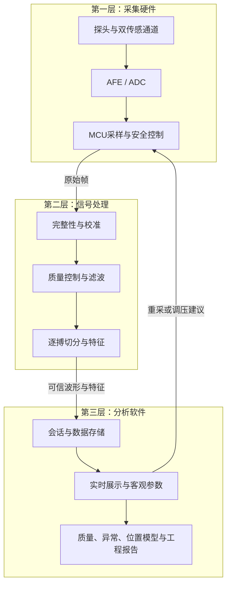
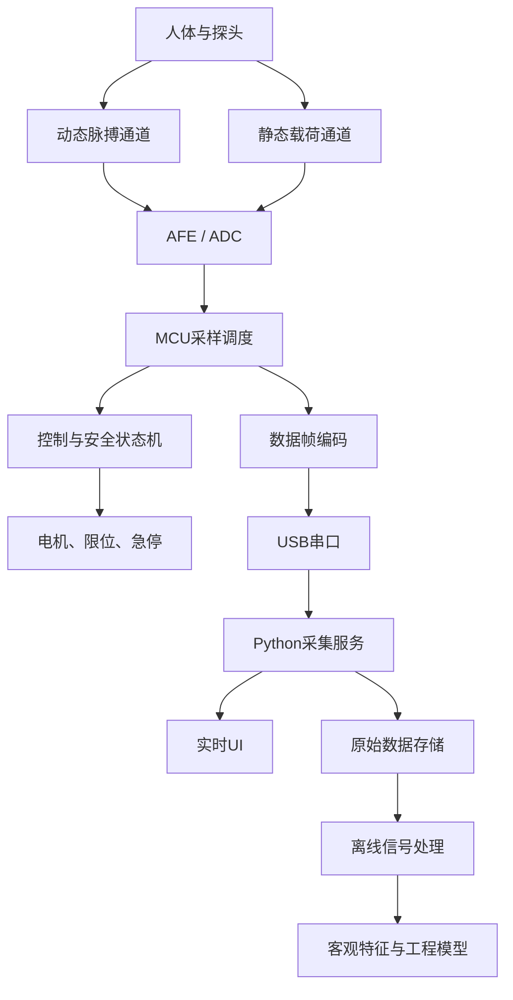

# 系统架构

## 1. 设计原则

- 原始数据优先：MCU不只发送处理结果，必须保留原始ADC与设备状态；
- 测量与控制解耦：动态脉搏通道和静态接触力通道分别设计；
- 安全独立：上位机失联不能阻止设备侧执行预定义安全响应；是否能主动卸载取决于执行器、传感器和释放机构是否仍可用；
- 协议先行：模拟器、固件和上位机共享同一份协议规范；
- 可追溯：校准、固件、硬件、算法和采集协议都有版本号；
- 可替换：传感器、ADC和执行器通过抽象接口替换；
- 渐进复杂：单点和重复性稳定后再引入自动寻脉；主体算法限于质量、异常和位置推荐，脉象研究仅属于可选H6。

## 2. 三层系统边界

| 层 | 包含模块 | 不包含 |
|---|---|---|
| 采集硬件层 | 探头、动态传感器、载荷传感器、模拟前端、ADC、MCU、电机、安全控制、通信编码 | 脉象分类和疾病判断 |
| 信号处理层 | 数据校验、校准、质量控制、滤波、伪影处理、逐搏切分、基础特征 | 用户报告和医疗解释 |
| 分析软件层 | 会话、存储、实时界面、客观参数、压力响应、重复性、质量/异常/位置模型、报告 | 脉象、证候、疾病判断或治疗建议 |

数据只允许从上游产生下游结果，但质量失败和压力寻优可以从分析软件反馈到采集硬件。安全闭环始终留在硬件层。

## 3. 端到端逻辑架构

## 4. 采集硬件模块

### 3.1 传感头

职责：

- 将腕部局部微小位移/压力传递给动态传感器；
- 将总体接触力传递给载荷传感器；
- 隔离电机结构振动；
- 支持可更换、清洁和尺寸实验。

接口：

- 动态传感器模拟输出或数字接口；
- 载荷传感器桥式输出；
- 探头结构版本ID。

### 3.2 数据采集

职责：

- 稳定激励传感器；
- 放大和抗混叠；
- 同步采样；
- 提供过载/断线诊断。

通道建议：

- CH0：动态脉搏；
- CH1：静态接触力；
- CH2：可选PPG参考；
- CH3：可选电机电流/结构振动。

### 3.3 控制器

职责：

- 定时采样和缓冲；
- 电机运动与压力闭环；
- 本地限位、安全上限和看门狗；
- 设备命令和数据流；
- 校准参数读取。

### 3.4 上位机

职责：

- 设备发现、连接和配置；
- 采集会话编排；
- 实时波形和状态显示；
- 原始数据落盘；
- 信号质量与重采建议；
- 历史会话、实验和导出。

## 5. 固件状态机

D3将控制状态冻结为BOOT、SELF_TEST、IDLE、APPROACH、CONTACT、STABILIZE、ACQUIRE、STEP、RETRACT、SAFE_HOLD和FAULT_LATCHED。安全判断在MCU边界本地执行，上位机只负责请求任务和显示状态。

ABORT或上位机失联在执行器与观测可用时进入受控RETRACT；急停立即禁止驱动，电机卡滞也不能假设仍可主动退回，因此进入SAFE_HOLD或FAULT_LATCHED。完整转移、故障优先级和安全不变量见[设备状态机与安全设计](../01-系统规范/设备状态机与安全设计.md)。

## 6. 时间与同步

每个数据帧至少包含：

- 单调递增设备时间戳；
- 帧序号；
- 采样序号；
- 各通道原始值；
- 电机位置；
- 控制状态；
- 限位/急停/故障位；
- 校准版本摘要。

参考设备同步优先顺序：

1. 共用硬件触发；
2. MCU采样参考通道；
3. 上位机发送同步事件；
4. 后处理互相关对齐。

## 7. 部署形态

### 开发阶段

- MCU经USB连接Windows电脑；
- Python采集服务作为唯一设备所有者；
- React通过WebSocket/SSE获取实时数据；
- 原始数据本地保存；
- 分析任务离线执行。

### 后续阶段

在系统稳定后再考虑：

- 无线通信；
- 边缘推理；
- 独立屏幕；
- 电池；
- 云端数据；
- H6条件具备后的外部专业研究协作。

这些能力不属于MVP。

## 8. 故障分类

| 类别 | 示例 | 设备动作 |
|---|---|---|
| 安全故障 | 压力超限、急停 | 立即禁止继续加压；按剩余能力退回、保持或锁存 |
| 机械故障 | 限位冲突、卡滞 | 驱动归零并锁存；不得假设故障执行器仍可卸载 |
| 传感故障 | 断线、冻结、饱和、漂移 | 禁止载荷闭环；仅在所需观测有效时受限退回 |
| 通信故障 | 上位机失联 | 完成安全退回 |
| 数据质量 | 运动、无脉搏、削顶 | 不作为安全故障，提示重采 |
| 软件故障 | 缓冲溢出、CRC连续失败 | 标记数据无效并安全结束 |

## 9. 接口边界

建议后续代码按以下包边界组织：

- `firmware/drivers`：ADC、传感器、电机、限位；
- `firmware/control`：压力控制和状态机；
- `firmware/protocol`：帧编码与命令；
- `simulator`：设备行为与信号生成；
- `apps/acquisition-service`：串口、会话和落盘；
- `apps/web`：实时界面；
- `analysis/signal`：滤波、切分、质量；
- `analysis/features`：客观参数；
- `analysis/models`：质量、异常和位置推荐模型；H6模型单独隔离；
- `protocols`：机器可读schema与文档。