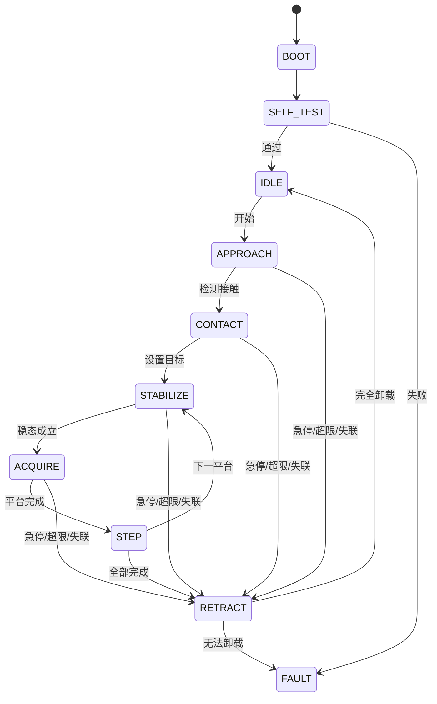

# 设备状态机与安全设计

## 1. 原则

- 安全闭环在MCU本地；
- 分析软件失联时仍可退回；
- 故障优先级高于采集命令；
- 硬件安全上限不能由普通会话参数覆盖；
- P0只验证状态语义，不宣称人体安全性。

## 2. 状态转换

## 3. P1前必须补齐的硬件安全机制

- 上下机械限位；
- 常闭急停；
- 独立最大行程；
- 本地载荷上限；
- 载荷传感器断线检测；
- 电机卡滞/超时；
- 看门狗；
- 断电手动释放；
- 低压供电与电气隔离评估。

任何人体测试前必须在仿体上执行故障注入测试。

