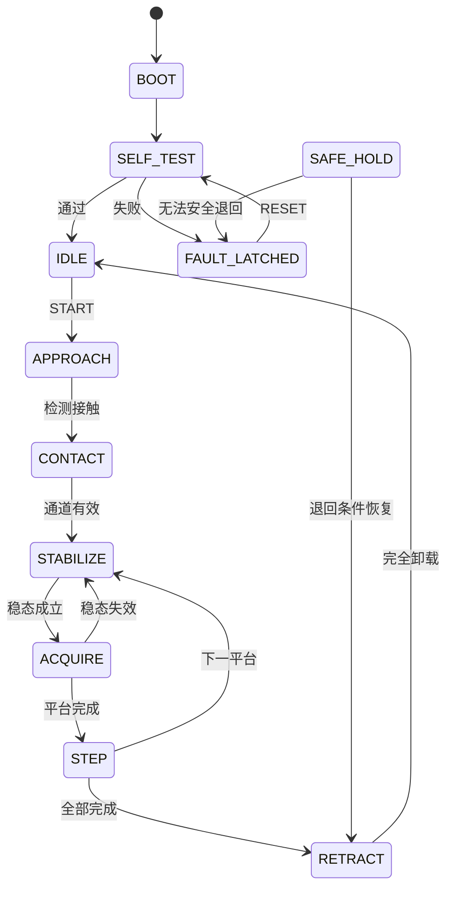

# 设备状态机与安全设计

版本：1.0.0  
状态：D3-A控制与安全契约基线。

## 1. 适用范围

本文定义D3数字仿真以及未来MCU实现必须保持的状态语义和安全边界。D3中的位置、速度和载荷均为合成相对单位，不是人体安全指标；真实硬件阈值、断电行为和释放结构必须在H1以后通过台架验证。

## 2. 原则

- 安全闭环属于设备侧，不依赖Web、上位机分析或网络；
- 故障优先级高于采集和目标设置命令；
- 普通会话参数不能覆盖本地硬阈值；
- 传感器无效时不得用最后值继续载荷闭环加压；
- 任何异常路径都不得停留在主动加压状态；
- 故障锁存只能经显式RESET和SELF_TEST退出；
- 急停与ABORT不是同一种动作。

## 3. 状态

| 状态 | 含义 |
|---|---|
| BOOT | 初始化 |
| SELF_TEST | 校验配置、传感器、限位和看门狗 |
| IDLE | 等待任务 |
| APPROACH | 低速寻找接触 |
| CONTACT | 确认接触和载荷通道 |
| STABILIZE | 闭环跟踪当前目标 |
| ACQUIRE | 稳态采集 |
| STEP | 切换目标 |
| RETRACT | 设备侧受控退回 |
| SAFE_HOLD | 禁止加压，等待可执行的退回或人工处理 |
| FAULT_LATCHED | 故障锁存，必须复位和自检 |

加压相关状态可因安全事件进入RETRACT、SAFE_HOLD或FAULT_LATCHED。具体结果由故障类型和剩余可用能力决定，不能笼统写成“全部自动退回”。

## 4. ABORT、急停和故障响应

| 场景 | 立即动作 | 目标状态 |
|---|---|---|
| ABORT | 中止Profile，设备侧受控卸载 | RETRACT |
| 上位机失联 | 本地超时，中止并受控卸载 | RETRACT |
| 一般超限 | 禁止继续加压；执行器和观测可用时退回 | RETRACT或FAULT_LATCHED |
| 急停 | 驱动命令立即归零并锁存 | SAFE_HOLD/FAULT_LATCHED |
| 载荷传感器失效 | 禁止载荷闭环；位置有效时受限退回 | RETRACT或FAULT_LATCHED |
| 位置传感器失效 | 驱动归零 | FAULT_LATCHED |
| 电机卡滞 | 驱动归零，不假设同一执行器还能退回 | FAULT_LATCHED |
| 限位冲突 | 驱动归零 | FAULT_LATCHED |
| 数据质量失败 | 当前分析窗口无效，不冒充安全故障 | STABILIZE/ACQUIRE |

急停通常意味着驱动被禁止，因此主动退回必须由未来硬件架构明确支持；否则只能依靠被动释放或人工释放。D3不虚构该能力。

## 5. 故障优先级

同一控制tick按以下顺序裁决：

1. 急停；
2. 非法数值或安全不变量破坏；
3. 载荷硬超限；
4. 限位冲突及上下限位；
5. 关键传感器失效；
6. 电机卡滞；
7. 看门狗超时；
8. 上位机心跳超时；
9. 状态超时或永不稳定；
10. 数据质量问题。

处理最高优先级故障时仍需记录同tick的其他故障，不得丢失证据。

## 6. 安全不变量

每个控制tick必须满足：

1. 非APPROACH/STABILIZE/ACQUIRE/STEP状态不得输出正向加压命令；
2. RETRACT不得输出正向命令；
3. 急停有效时命令恒为0；
4. 载荷达到硬模型上限后不得继续增加压缩；
5. 上限位有效时不得向加压方向运动；
6. 下限位有效时不得向退回方向运动；
7. 载荷传感器无效时不得继续载荷闭环加压；
8. 看门狗或通信超时后不得继续当前Profile；
9. FAULT_LATCHED只能经RESET和SELF_TEST退出；
10. NaN、Inf、非法状态或时间倒退必须安全终止；
11. START、SET_TARGET等普通命令不得清除锁存故障；
12. Web或上位机断开不能阻止设备侧安全响应。

## 7. 事件证据

每个安全事件至少记录：

- tick和单调设备时间；
- 故障码、优先级和来源；
- 原状态、动作和目标状态；
- 是否锁存；
- 位置、速度、载荷、命令、限位、急停和传感有效性快照。

机器契约：

- `src/digital_pulse/d3_contracts.py`
- `protocols/d3-safety.schema.json`
- `protocols/d3-safety-event.schema.json`
- `protocols/d3-scenario.schema.json`

## 8. 真实硬件前必须补齐

- 上下机械限位及其失效检测；
- 常闭急停和驱动断能链路；
- 独立最大行程与本地载荷上限；
- 载荷和位置传感器断线/冻结检测；
- 电机卡滞、电流和运动超时；
- 独立看门狗；
- 断电被动释放或人工释放；
- 低压供电、电气隔离、温升和夹伤风险评估。

任何人体测试前必须先在仿体上完成真实硬件故障注入；D3仿真通过不能替代该步骤。
