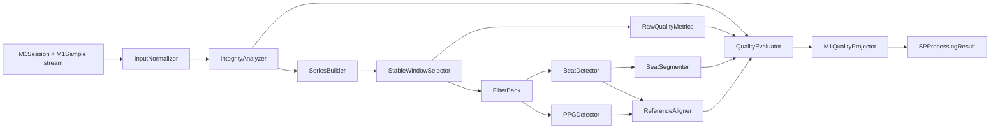

# M1 SP-S1-pre架构与数据流设计

版本：0.1.0；状态：设计冻结，等待M1-P2A实现。

## 1. 设计目标

SP-S1-pre必须把“采集事实”和“处理推断”严格分离：

```text
M1Sample/M1Session = 采集事实
SP internal models = 处理过程证据
M1QualityResult = 冻结正式质量输出
```

生产代码只依赖正式M1输入和SP参数，不依赖模拟器场景ID、FaultPlan或expected oracle。

## 2. 公共入口

建议统一入口：

```python
SPProcessor.process(
    session: M1Session,
    samples: Iterable[M1Sample],
    *,
    config: SPConfig,
) -> SPProcessingResult
```

约束：

- 输入可来自SimulatorDataSource、ReplayDataSource、未来HardwareDataSource；
- 不修改输入对象；
- 不读取会话目录中的`scenario.json`或`expected.json`；
- 不负责把处理结果写回磁盘；
- 相同输入+config必须产生完全相同结果。

## 3. 组件关系



## 4. 强类型内部模型

建议在`models.py`定义以下冻结dataclass。

### 4.1 SPInputBundle

```text
session
samples
sample_rate_hz
configured_channels
processing_version
parameter_version
configuration_digest
```

### 4.2 ChannelSeries

```text
device_time_us: ndarray[int64]
host_time: tuple[str, ...]
values_raw: ndarray[float64]
valid_mask: ndarray[bool]
connected_mask: ndarray[bool]
clipping_lower_mask: ndarray[bool]
clipping_upper_mask: ndarray[bool]
```

缺失通道值进入`valid_mask=false`，内部数组可用NaN承载计算缺失，但不得把NaN写回M1正式JSON。

### 4.3 IntegrityEvidence

```text
crc_error_indices
sequence_gap_indices
missing_frame_count
timestamp_error_indices
disconnected_indices
persistence_failed
session_completed
terminal_device_state
terminal_fault_flags
blocking_codes
```

### 4.4 WindowSlice

```text
window_id
start_index
end_index_exclusive
start_device_time_us
end_device_time_us
sample_count
valid_duration_s
valid_fraction
excluded_reason_codes
```

窗口索引采用半开区间`[start, end)`，避免边界歧义。

### 4.5 QualityMetricsInternal

正式metric超集，仅在SP内部：

```text
valid_fraction
clipping_fraction
baseline_drift_raw
pulse_std_raw
beat_count
ppg_match_rate
load_median_raw
load_std_raw
load_slope_raw_per_s
hf_residual_ratio
pulse_peak_prominence_median
beat_interval_cv
ppg_median_lag_ms
ppg_lag_mad_ms
```

### 4.6 BeatCandidate

```text
peak_index
peak_device_time_us
peak_raw
peak_filtered
prominence
foot_index | None
valid
reason_codes
```

### 4.7 BeatSegment

```text
beat_id
start_index
peak_index
end_index_exclusive
device_time_us_start/peak/end
raw_values
filtered_values
normalized_values
valid
reason_codes
```

归一化副本只用于形态比较，绝不能覆盖raw/filtered数据。

### 4.8 ReferenceMatchSummary

```text
pulse_beat_count
ppg_beat_count
matched_count
match_rate
median_lag_ms
lag_mad_ms
unmatched_pulse_indices
unmatched_ppg_indices
```

### 4.9 SPProcessingResult

```text
processing_status
quality_results
windows
beats
integrity
metrics_by_window
reference_summary
blocking_codes
processing_version
parameter_version
parameter_status
configuration_digest
```

`processing_status`建议：

```text
completed
completed_with_quality_failure
blocked_before_quality
invalid_input
```

## 5. 输入归一化

InputNormalizer负责：

- materialize有限sample stream；
- 验证非空session_id；
- 验证sample.session_id与session.session_id一致；
- 保留原始顺序；
- 建立channel masks；
- 不修复frame sequence；
- 不排序timestamp regression；
- 不补齐丢帧；
- 不把null转换成0。

输入长度可以与`M1Session.integrity_summary.frame_count`不一致；不一致必须作为evidence，而不是静默截断。

## 6. IntegrityAnalyzer

### 6.1 结构级硬错误

以下条件直接产生结构性integrity evidence：

- 显式`crc_valid=false`；
- 显式`sequence_valid=false`；
- 显式`timestamp_valid=false`；
- 可见frame sequence缺口；
- 可见device_time回退；
- connected channel value非法（理论上M1Sample Schema已阻断）；
- `sensor_disconnected`等通道失效；
- persistence failed/partial；
- manifest与实际样本计数明显矛盾。

### 6.2 不做的事情

IntegrityAnalyzer不：

- 根据scenario_id猜丢帧；
- 根据expected.json决定失败；
- 用滤波后的波形判断CRC；
- 把设备ABORT解释成普通信号质量差。

## 7. StableWindowSelector

### 7.1 候选掩码

一个样本进入候选稳定窗口至少满足：

```text
device_state == ACQUIRE
pulse/load required channel可用
无显式receive integrity失败
非terminal fault之后
```

对PPG：

- PPG不可用不一定阻断pulse窗口；
- 但reference evidence必须记录`reference_unavailable`。

### 7.2 连续性

窗口必须在真实设备时间上连续。

以下情况切断窗口：

- sequence gap；
- timestamp invalid/regression；
- terminal device transition；
- sensor disconnect；
- 长时间invalid mask；
- 明确motion exclusion区间（仅当由观测指标检测到）。

不得把两个分离窗口拼接后声称`valid_duration_s`连续。

### 7.3 load稳定性

Load稳定性使用内部raw-domain指标：

- rolling range；
- rolling std；
- slope；
- 可选normalized variability。

阈值在P2阶段为`simulation_only`；真实阈值待H1。

## 8. RawQualityMetrics

质量检测的主要指标从raw-domain计算。

### 8.1 clipping

优先使用M1Sample.clipping flag，而不是仅通过ADC值猜测。

```text
clipping_fraction = clipped valid pulse samples / valid pulse samples
```

上下削顶分别保留内部count，并投影为正式reason code。

### 8.2 pulse amplitude

正式`pulse_std_raw`使用有效窗口raw pulse标准差。

弱信号判断不允许直接读取模拟器`pulse_amplitude_scale`。

### 8.3 baseline drift

建议至少计算两类内部证据：

- robust first/last segment median差；
- 线性trend slope。

正式投影`baseline_drift_raw`采用有明确方向和单位的单一定义，并在实现文档冻结公式。

### 8.4 motion

首版运动指标建议组合：

- pulse高频残差；
- load同步扰动；
- 短时突变幅值。

不得把所有高频变化解释为运动；beat主频和motion band必须分开。

### 8.5 no contact / unstable load

no contact只在多证据一致时判定，例如：

```text
load raw接近simulation-only无接触区域
AND pulse近常量/极低变异
AND sensor status仍connected
```

`sensor disconnected`优先级高于no_contact。

unstable load保留内部`unstable_contact_load` evidence；正式投影为`manual_review_required + manual_review_requested`，因为M1-P0 reason枚举未包含load-specific code。

## 9. FilterBank

### 9.1 原则

质量检测与滤波顺序必须防止“滤波修复质量问题”。

```text
raw integrity/raw quality
          ↓
      filter views
          ↓
beat/reference analysis
```

### 9.2 CausalFilter

设计为固定系数、状态可重置的因果FIR：

- 仅使用当前和历史样本；
- kernel由SPConfig生成；
- group delay可计算；
- chunked输入与一次性输入结果一致；
- 不使用未来值。

### 9.3 OfflineReviewFilter

使用对称FIR/对称边界扩展生成离线复核视图：

- 允许使用未来样本；
- 输出metadata明确`filter_mode=offline_review`；
- 不用于未来实时延迟声明。

### 9.4 依赖

P2首版优先NumPy-only FIR，避免立即引入SciPy。

如后续证明Butterworth/filtfilt等实现有明确必要性，应单独评审依赖、版本和跨平台确定性。

## 10. BeatDetector / BeatSegmenter

### 10.1 候选检测

基于offline filtered pulse：

1. robust center/noise estimate；
2. local maxima；
3. minimum prominence；
4. refractory interval；
5. 相邻候选冲突消解；
6. foot candidate搜索。

阈值来自parameter profile，不来自scenario ID。

### 10.2 interval

只输出客观时间间隔：

```text
IBI_ms
estimated_rate_bpm
interval_cv
```

P2不解释心律疾病。

### 10.3 insufficient beats

有效窗口时间足够但beat_count不足时：

```text
reason_codes += insufficient_beats
```

primary label按quality precedence决定。

## 11. ReferenceAligner

### 11.1 匹配

采用单调、一对一匹配：

- pulse beat按时间递增；
- PPG beat按时间递增；
- 每个beat最多匹配一次；
- 使用配置的最大候选lag窗口；
- 不通过重排beat制造更高match rate。

### 11.2 输出

正式：

```text
ppg_match_rate
```

内部：

```text
median_lag_ms
lag_mad_ms
unmatched indices
```

PPG真实延迟范围在H1前不可标记为真实生理阈值。

## 12. QualityEvaluator

### 12.1 blocked-before-quality

检查顺序第一位：

```text
emergency_stop / SAFE_HOLD
unsupported generic device fault
```

返回空quality，不把不存在于M1 reason enum的原因塞入M1QualityResult。

### 12.2 data integrity

以下正式映射为`data_integrity_failure`：

| Evidence | reason code |
|---|---|
| CRC | `crc_errors` |
| sequence | `sequence_gaps` |
| timestamp | `timestamp_errors` |
| disconnect | `sensor_disconnected` |
| persistence | `persistence_failed` |

### 12.3 signal quality precedence

```text
no_contact
saturated
insufficient_duration
motion_artifact
unstable_baseline
weak_signal
reference_mismatch
manual_review_required
acceptable
```

primary label唯一，但允许多个兼容reason code。

## 13. M1QualityProjector

每个可分析窗口生成一个`M1QualityResult`。

冻结规则：

```text
session_id = input session
window_id = deterministic stable ID
start/end = WindowSlice device time
label = QualityEvaluator primary label
score = null
confidence = null
reason_codes = 仅M1 schema允许值
metrics = 仅M1 schema允许键
valid_duration_s = 窗口真实有效时长
processing_version = SP代码版本
parameter_version = 参数profile版本
parameter_status = simulation_only（P2模拟验收）
```

window_id建议由：

```text
session_id + start_device_time_us + end_device_time_us + window_index
```

确定性生成，不使用随机UUID。

## 14. provenance与digest

SPConfig必须可canonical serialize，并产生SHA-256 digest。

摘要至少覆盖：

- profile/version；
- window参数；
- filter kernel参数；
- beat detector参数；
- reference alignment参数；
- quality rule参数；
- parameter status。

不纳入：

- 绝对路径；
- 当前时间；
- Python对象地址；
- temporary directory。

## 15. 错误模型

建议统一：

```python
class SPProcessingError(ValueError):
    code: str
```

至少区分：

```text
invalid_config
invalid_input
session_mismatch
empty_samples
unsupported_parameter_status
filter_configuration_error
insufficient_reference
projection_error
```

算法质量失败不是exception；它是正常`M1QualityResult`。

## 16. 未来HardwareDataSource兼容性

P2设计不得假设：

- simulator_version存在；
- scenario_id存在；
- random_seed存在；
- Pulse/Load/PPG真实量级等于模拟器。

只有simulation-only profile可以依赖模拟数据量级；未来hardware运行必须要求H1参数profile。

## 17. 设计完成定义

本设计完成后，P2A可以在不再讨论总体架构的前提下直接实现：

```text
config/models
→ normalize/integrity
→ windowing
→ structural tests
```

P2A不得提前实现QualityEvaluator完整分类、BeatDetector或PPG匹配。
