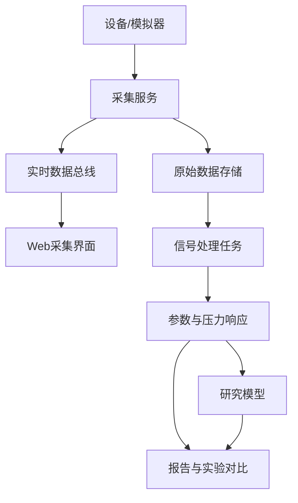

# 分析软件方案

## 1. 本层职责

分析软件接收信号处理层输出的可信波形、逐搏片段、质量标记和特征，负责：

- 组织采集会话；
- 实时展示设备与波形；
- 保存原始及派生数据；
- 计算客观脉搏参数和多压力响应；
- 在数据条件满足后运行研究模型；
- 生成可追溯的研究报告；
- 当质量不足时拒绝分析并请求重采。

它不是简单的“AI分类界面”，也不能绕过信号处理直接读取未经质控的波形作诊断。

## 2. 推荐技术栈

结合现有能力：

- Python 3.12、pyserial、Pydantic；
- FastAPI；
- WebSocket用于实时数据，SSE用于状态事件；
- React、TypeScript；
- SQLite起步，协作后迁移PostgreSQL；
- Parquet保存表格型采样数据，复杂多通道后评估HDF5/Zarr；
- NumPy、SciPy、pandas、scikit-learn；
- 数据充分后使用PyTorch；
- pytest和Vitest。

第一阶段不引入微服务、消息队列、Kubernetes和云端系统。

## 3. 软件组件



### 3.1 设备模拟器

在真实硬件前实现，与固件共用协议：

- 合成脉搏、压力平台和设备状态；
- 注入噪声、漂移、丢帧和故障；
- 固定随机种子；
- 实时发送与离线回放；
- 生成黄金测试数据。

### 3.2 采集服务

作为唯一设备所有者：

- 设备握手和能力查询；
- 校验协议、固件和校准版本；
- 发送采集配置；
- 解码、CRC、序号和时间检查；
- 原始帧优先落盘；
- 向界面发送降采样显示数据；
- 接收信号质量结果；
- 记录故障、重试和不完整会话。

### 3.3 Web界面

MVP页面：

1. 设备状态；
2. 匿名受试者与新建会话；
3. 实时脉搏、载荷、目标值和状态机；
4. 信号质量及失败原因；
5. 原始/处理波形对照；
6. 多压力响应；
7. 重复测量和参考设备对比；
8. 硬件、传感器、探头和校准管理。

### 3.4 分析引擎

第一阶段输出客观量：

- 心率和节律；
- 心搏间期；
- 幅值、上升时间、波宽、面积等形态；
- 各压力平台质量；
- 压力—幅值和压力—形态曲线；
- 个体最佳采集压力区间；
- 重复性统计。

## 4. 数据模型

### 4.1 会话元数据

至少包含：

- `session_id`、匿名`subject_id`；
- 左右手和采集位置；
- 姿势、休息、运动、进食、咖啡因等条件；
- 操作者；
- 硬件、固件、传感器、探头和校准版本；
- 压力profile；
- 完成状态和无效原因。

### 4.2 会话文件

```text
session-id/
├── manifest.json
├── raw_frames.bin
├── samples.parquet
├── events.jsonl
├── processed/
│   ├── quality.parquet
│   ├── waveform.parquet
│   ├── beats.parquet
│   └── features.json
└── report.json
```

人体原始数据不得提交公开Git仓库。仓库仅保存合成或充分匿名的示例数据。

## 5. 分析能力分级

| 等级 | 能力 | 进入条件 |
|---|---|---|
| A0 | 实时波形和设备状态 | 模拟协议通过 |
| A1 | 心率、逐搏和质量 | 与参考设备验证 |
| A2 | 多压力客观响应 | 压力通道和重复性通过 |
| A3 | 自动寻脉与重采决策 | 多点硬件通过 |
| A4 | 浮沉迟数等候选脉象 | 医生标签和受试者级测试 |
| A5 | 证候/疾病研究 | 临床、伦理和监管路线建立 |

软件必须根据当前验证等级控制可展示的功能，未验证模块使用“研究中”标识。

## 6. AI策略

顺序：

1. 规则和阈值基线；
2. Logistic Regression；
3. Random Forest/XGBoost；
4. 多标签概率模型；
5. 数据足够后评估1D-CNN、TCN或Transformer。

要求：

- 按受试者拆分数据；
- 报告简单基线；
- 输出概率和不确定性；
- 分析年龄、性别、腕围等亚组；
- 记录医生间一致性；
- 保留独立测试集；
- 不使用LLM直接读取原始波形。

LLM只可根据结构化结果生成说明、追问采集条件或调用重采工具，不能成为原始信号测量算法。

## 7. 隐私与安全

- API默认仅监听本机；
- 最少化采集身份信息；
- 日志不记录姓名和联系方式；
- 原始数据和标注分权管理；
- 报告标明研究用途；
- 质量不足时不生成结果；
- 后续联网前单独建立认证、加密和威胁模型。

## 8. 验收

- 模拟器到界面的端到端流程可运行；
- UI阻塞不影响原始数据落盘；
- 原始会话可完全重放；
- 同一输入和算法版本输出一致；
- 数据、硬件、校准和模型可追溯；
- 质量失败能够阻断分析；
- 所有展示数字能够链接到实验记录。