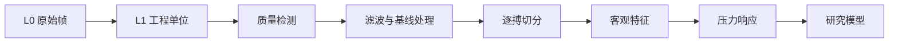

# 软件与数据方案

## 1. 目标

软件不是单纯显示曲线，而是保证每一次测量从设备、校准、采集状态到派生结果都可追溯，并让模拟设备与真实硬件使用相同接口。

## 2. 推荐技术栈

结合现有能力，采用：

- 固件：C/C++、PlatformIO；
- 采集服务：Python 3.12、pyserial、Pydantic；
- API：FastAPI；
- 实时通信：WebSocket，状态事件可使用SSE；
- Web界面：React、TypeScript；
- 原始数据：开发期Parquet，复杂多通道实验后评估HDF5/Zarr；
- 元数据：SQLite起步，协作后迁移PostgreSQL；
- 分析：NumPy、SciPy、pandas、scikit-learn；
- 深度学习：达到数据门槛后使用PyTorch；
- 测试：pytest、Vitest，固件使用Unity或PlatformIO测试。

避免第一阶段引入微服务、消息队列、Kubernetes或云平台。

## 3. 组件

### 3.1 设备模拟器

必须在真实固件前完成。

功能：

- 生成周期性桡动脉样波形；
- 调整心率、形态、幅值和节律；
- 添加基线漂移、白噪声、工频、运动伪影和削顶；
- 模拟接触、稳态、采集、换挡、退回和故障；
- 按正式协议发送数据；
- 支持固定随机种子；
- 生成黄金数据用于回归测试。

### 3.2 采集服务

作为唯一串口所有者，负责：

- 发现并握手设备；
- 校验硬件与协议版本；
- 发送会话配置；
- 解码、CRC和帧序号检查；
- 双缓冲或队列处理；
- 原始帧优先落盘；
- 将降采样显示数据推送给前端；
- 上报丢帧、延迟和设备故障；
- 断连后确保会话标记为不完整。

### 3.3 Web界面

MVP页面：

1. 设备状态：连接、版本、校准、限位、故障；
2. 新建会话：匿名受试者、左右手、位置和条件；
3. 实时采集：波形、载荷、目标值、状态机和质量；
4. 会话详情：原始/处理波形、压力平台和事件；
5. 实验对比：重复测量与参考设备；
6. 管理页面：硬件、传感器和校准记录。

### 3.4 分析流水线



每个步骤：

- 输入输出有schema；
- 记录代码提交和参数；
- 不覆盖上游数据；
- 可以从L0完全重放；
- 单元测试覆盖边界情况。

## 4. 通信协议草案

开发早期允许CSV模式便于调试，正式采集采用二进制帧。

### 4.1 数据帧字段

| 字段 | 类型建议 | 说明 |
|---|---|---|
| magic | uint16 | 固定帧头 |
| protocol_version | uint8 | 协议版本 |
| message_type | uint8 | 数据/事件/响应 |
| payload_length | uint16 | 负载长度 |
| frame_sequence | uint32 | 丢帧检测 |
| device_time_us | uint64 | 单调时间 |
| sample_sequence | uint32 | 采样序号 |
| pulse_raw | int32 | 动态通道原始值 |
| force_raw | int32 | 载荷原始值 |
| reference_raw | int32 | 可选参考通道 |
| motor_position | int32 | 电机位置 |
| target_force | int32 | 控制目标 |
| device_state | uint16 | 状态机 |
| status_flags | uint32 | 限位、饱和、故障 |
| crc32 | uint32 | 完整性校验 |

具体字节序、缩放、缺省值和版本兼容规则应在`protocols/`中生成机器可读定义。

### 4.2 命令

- HELLO / GET_CAPABILITIES；
- START_SESSION；
- SET_ACQUISITION_CONFIG；
- START_PRESSURE_PROFILE；
- ABORT_AND_RETRACT；
- CALIBRATE_ZERO；
- GET_STATUS；
- ACK / NACK。

安全命令`ABORT_AND_RETRACT`应可被高优先级处理。

## 5. 数据模型

### 5.1 受试者

只保存研究需要的最少信息：

- subject_id：随机生成；
- 年龄段而非不必要的完整生日；
- 生理性别（若研究需要）；
- 腕围、BMI分组等必要变量；
- 同意记录；
- 不在仓库提交可识别个人信息。

### 5.2 采集会话

- session_id；
- subject_id；
- 开始/结束时间；
- 左/右手；
- 寸/关/尺或自定义位置；
- 姿势、休息时间；
- 近期运动、咖啡因、进食等条件；
- 操作者ID；
- device_id、hardware_revision；
- firmware_version；
- sensor_id、probe_revision；
- calibration_id；
- pressure_profile_id；
- completion_status；
- invalid_reason。

### 5.3 数据文件

建议一个会话目录包含：

```text
session-id/
├── manifest.json
├── raw_frames.bin
├── samples.parquet
├── events.jsonl
├── derived/
│   ├── quality.parquet
│   ├── beats.parquet
│   └── features.json
└── report.json
```

受试者数据默认不提交Git。仓库只提交合成数据、小型匿名示例和schema。

## 6. 信号处理顺序

1. CRC和帧序号检查；
2. ADC饱和、断线和时间戳异常；
3. 工程单位换算；
4. 识别压力切换和机械振动窗口；
5. 基线漂移处理；
6. 低通/带通；
7. 心搏峰或足点检测；
8. 周期质量与异常搏动；
9. 单搏归一化副本；
10. 保留未归一化幅值用于压力响应；
11. 计算质量、形态和节律特征。

滤波必须同时保存零相位离线版本和未来实时因果版本，不能用离线零相位结果冒充实时性能。

## 7. 模型策略

### 7.1 质量模型

优先级最高，输出：

- good；
- no_contact；
- weak_signal；
- motion_artifact；
- sensor_saturation；
- pressure_transition；
- irregular_or_unknown。

### 7.2 客观参数

先用确定性算法估计：

- 心率；
- 心搏间期；
- 波峰、足点、重搏切迹候选；
- 上升/下降时间；
- 波宽、面积和斜率；
- 不同压力下的幅值与质量；
- 最佳压力区间。

### 7.3 脉象模型

采用多标签与概率输出，不做单一互斥分类。必须报告：

- 置信区间；
- 校准；
- 灵敏度/特异度或适合多标签的指标；
- 受试者级独立测试；
- 年龄、性别、腕围等亚组；
- 医生间一致性上限。

## 8. 隐私和安全

- 原始人体数据不进入公开仓库；
- 示例数据必须合成或充分匿名；
- 日志不得记录姓名和联系方式；
- API默认仅本机监听；
- 后续联网前建立威胁模型、身份认证和加密；
- 报告明确研究用途，不提供治疗建议。